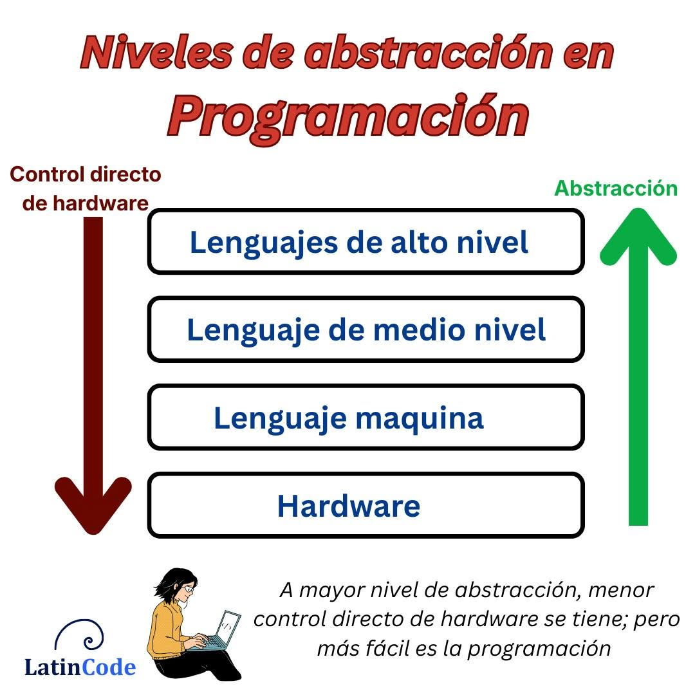
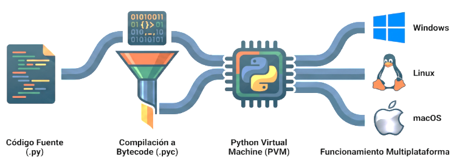
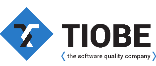
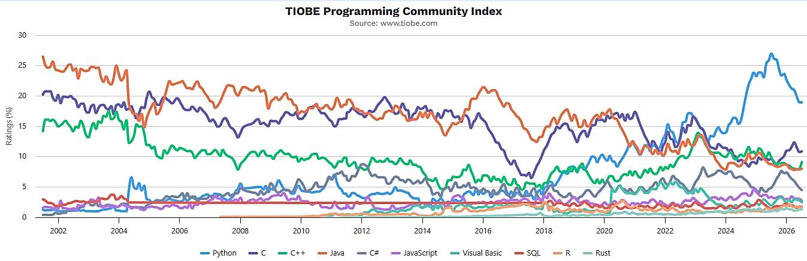
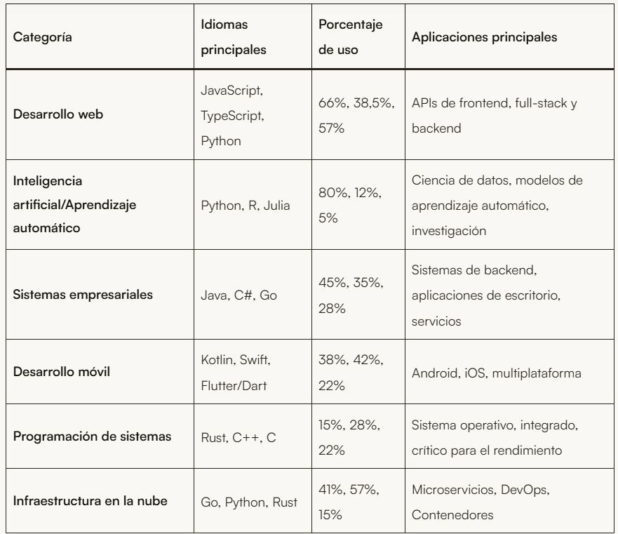
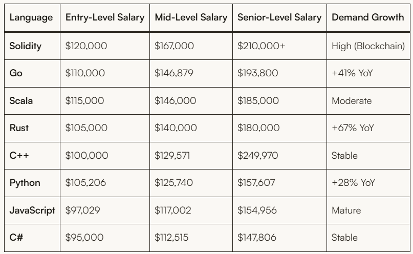
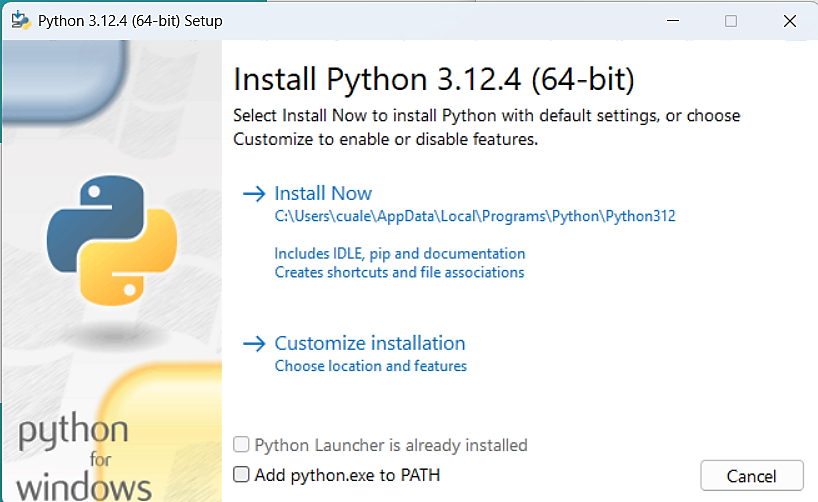

# Introducción al ecosistema de Python

_Contextualizando a Python entre los lenguajes de programación_

## ¿Por qué leemos este capítulo?

Este capítulo tiene como objetivo contextualizar a Python dentro del amplio universo de los lenguajes de programación. Como estudiantes que ya han sido iniciados en la programación mediante el lenguaje C, comprender dónde se ubica Python, cómo funciona internamente y por qué toma ciertas decisiones de diseño, es fundamental para lograr una transición exitosa.

## Los Niveles de los Lenguajes de Programación

Los lenguajes de programación se clasifican en diferentes niveles según su cercanía con la arquitectura física de la computadora (el hardware). Esta clasificación determina la velocidad de ejecución, la complejidad para el programador y la portabilidad del código.

**BAJO NIVEL:** Están muy cerca del lenguaje máquina (ceros y unos). Son extremadamente rápidos porque el procesador los entiende casi directamente, pero son muy difíciles de leer para los humanos. Ejemplos: El lenguaje Ensamblador (Assembly).

**MEDIO NIVEL:**  Ofrecen un equilibrio. Permiten manipular el hardware y la memoria de manera directa (como los punteros), pero ya tienen abstracciones que facilitan la escritura de algoritmos complejos. Ejemplo principal: Lenguaje C siendo el rey indiscutido de este nivel y la base de casi todos los sistemas operativos modernos

**ALTO NIVEL:** Están diseñados para estar lo más cerca posible del lenguaje humano (inglés estructurado). Ocultan por completo los detalles del hardware, como la gestión de la memoria o los registros del procesador. Son más lentos que C, pero permiten al programador enfocarse exclusivamente en resolver el problema lógico. Ejemplo principal: Python. Es uno de los lenguajes de más alto nivel que existen hoy en día.



**Características Técnicas de Python frente a otros Lenguajes**

Para un programador de C, entender las diferencias arquitectónicas de Python es más importante que aprender su sintaxis. A continuación, se detallan las características fundamentales que separan a Python de lenguajes como C, C++ o Java:

### 1. Compilado vs. Interpretado

**En C (Compilado):** Escribís el código, usás un compilador (como GCC) que lee todo el archivo y lo traduce de una sola vez a un archivo binario ejecutable (lenguaje máquina). Si hay un error de sintaxis, el programa no se crea.

**En Python (Interpretado): CPython** es la implementación estándar de Python, que utiliza una máquina virtual llamada PVM (**Python Virtual Machine**). Cuando escribes **código Python (.py)**, este es compilado a **bytecode (.pyc)** que es ejecutado por la PVM. Esto permite que Python sea un lenguaje interpretado multiplataforma: el mismo código fuente funciona en Windows, Linux, macOS y otros sistemas operativos sin necesidad de recompilar tu código (aunque requiere que CPython esté instalado en cada plataforma).



### 2. Tipado de Datos

**Estático (C, Java):** Tenés que declarar el tipo de variable antes de usarla int x = 5;. Si después intentás guardar un texto en “x”, el compilador se lo impide. El tipo está atado a la caja de memoria.

**Dinámico (Python):** No se declara el tipo. La variable es solo una etiqueta x = 5. Luego podés hacer x = "Hola" y Python no se queja, simplemente cambia a qué objeto en memoria apunta la etiqueta.

**Nota técnica:** Python tiene tipado dinámico, pero es de tipado fuerte no mezcla tipos implícitamente. Por ejemplo, sumar un número y un texto da error.

### 3. Gestión de la Memoria

**Manual (C):** El programador es el dueño absoluto de la memoria. Pedís memoria `malloc`, la usás y vos mismo tenés que liberarla `free`. Si te equivocás, generás Fugas de memoria (Memory Leaks) o el temido Segmentation Fault al acceder a memoria no permitida.

**Automática (Python):** Python incluye un mecanismo llamado **Garbage Collector** (Recolector de Basura). Él solo se encarga de asignar la memoria cuando creás una variable y de liberarla automáticamente cuando detecta que esa variable ya no se está utilizando en ninguna parte del programa. En Python no existen los punteros manipulables por el usuario.

### 4. Sintaxis y Estructura

**C:** Utiliza llaves { } para delimitar bloques de código y punto y coma ; para finalizar instrucciones. Permite escribir código compacto pero difícil de leer si no se tiene buena práctica.

**Python:** Elimina las llaves y los punto y coma. Utiliza la indentación (espacios en blanco al inicio de la línea) de forma obligatoria para delimitar los bloques. Esto fuerza a que todo el código escrito en Python tenga un formato visual ordenado y legible.

## ¿Qué es Python? Orígenes y Filosofía

Python fue creado a finales de los años 80 por **Guido van Rossum** en los Países Bajos. Su primera versión pública fue lanzada en 1991.

**El mito del nombre:** Contrario a la creencia popular, el nombre no proviene de la serpiente. Van Rossum era un gran fan del grupo de comedia británico **Monty Python**. Buscaba un nombre corto, único y un poco misterioso. Por esto, en la documentación oficial de Python es muy común encontrar ejemplos que hablan de **spam** y **huevos** en honor a los sketchs del grupo.

**La Filosofía, el Zen de Python**

Si abrís un intérprete de Python y escribís import this, aparecerá un poema llamado El **Zen de Python.** Las máximas principales, que resumen la transición desde C, son:

_La legibilidad cuenta_

_Debería haber una, y preferiblemente solo una, forma obvia de hacerlo._



## Python en el Mundo Real: El Ranking

El Índice TIOBE (<https://www.tiobe.com/tiobe-index/>) mide la popularidad de los lenguajes de programación según las búsquedas en internet. Actualmente, Python se encuentra en el puesto Nº 1, desplazando a C, Java y C++.



### ¿Por qué un lenguaje de alto nivel superó a C en popularidad?

**Explosión de la Inteligencia Artificial:** Librerías como TensorFlow, PyTorch o Pandas tienen su interfaz en Python (aunque su **motor interno esté escrito en C por velocidad**).

**Desarrollo Web Ágil:** Frameworks como **Django** (que veremos en la segunda mitad de la materia) permiten construir backends robustos y seguros en una fracción del tiempo.

**Curva de aprendizaje:** Es el lenguaje que más se asemeja al pseudocódigo, permitiendo a profesionales de otras áreas (matemáticos, biólogos, economistas) programar sin necesidad de estudiar 4 años de ingeniería en sistemas.



### Aplicaciones con Python

Comprender que lenguajes predominan en ciertas categorías te ayuda a tomar decisiones de carrera y de stack tecnológico más acertadas.

### ¿Cuánto se cotiza un desarrollador experto en Python?

La remuneración varía significativamente según el lenguaje, lo que refleja tanto la demanda como la escasez de desarrolladores experimentados. A continuación, se muestra una comparación de los lenguajes más populares en términos de salarios promedio en EEUU:



## Especificaciones Técnicas para la Cátedra

Para asegurar que todos trabajen en el mismo entorno y evitar problemas de compatibilidad, la materia rige las siguientes versiones:

**Versión de Python Objetivo:** Python 3.13.x. No utilizar versiones 2.x ni versiones en fase Alfa/Beta.

**Entorno de Desarrollo:** Visual Studio Code (VSC).

**Plugins** obligatorios para VSC:

- **Python (Microsoft):** Para autocompletado y selección de intérprete.
- **Python Indent:** Ayuda visual fundamental para quienes vienen de usar llaves en C.
- **Error Lens:** Muestra los errores de sintaxis directamente sobre la línea de código.
- **Flake8:** Revisa estándar de Python

**Compatibilidad con Django:** Al momento de instalar el framework web en las próximas clases, se utilizará Django 5.2 LTS la cual requiere estrictamente Python 3.10 o superior.

### Instalación Python Windows

Descargar: <https://www.python.org/downloads/> (seleccionar Python 3.13.x)

En el instalador, MARCAR OBLIGATORIAMENTE:

✅ Add Python.exe to PATH (esto es crítico)

✅ Install pip

Elegir: Install Now (instalación estándar)

**IMPORTANTE**

Si no seleccionas Add Python.exe to PATH tu sistema operativo no va a encontrar el ejecutable python.exe y te informa  "python is not recognized as an internal or external command"



### Instalación Python Linux

Python 3.13 no está en los repositorios oficiales de Ubuntu 24.04 LTS, que incluye 3.12 por defecto. Para instalar 3.13 agregamos el repositorio deadsnakes, mantenido por la comunidad.

Agregar el repositorio:

```bash
sudo add-apt-repository ppa:deadsnakes/ppa
```

Actualizar repositorios:

```bash
sudo apt update
```

Instalar Python 3.13 y herramientas esenciales:

```bash
sudo apt install -y python3.13 python3.13-venv python3.13-dev
```

Verificar instalación:

```bash
python3.13 --version
```

Sobre pip: en Linux no hace falta instalarlo a nivel del sistema. Se instala dentro de cada entorno virtual, que es la forma correcta de trabajar (ver la sección siguiente).

Otras distribuciones: los comandos varían según la distro. En Fedora el gestor de paquetes es dnf y en Arch es pacman. Si usás algo distinto de Ubuntu o Debian, consultá en clase antes de instalar.

¿Por qué no un alias? Podrías tener la tentación de crear un alias (alias python='python3.13') para no escribir el número de versión cada vez. No lo hagas: el alias tapa el problema en lugar de resolverlo, y en un equipo con varias versiones instaladas termina generando confusión sobre qué intérprete estás usando realmente. La solución correcta son los entornos virtuales.

### Entornos virtuales (venv)

Un entorno virtual es una carpeta aislada donde se instalan las librerías de un proyecto, sin tocar la instalación de Python del sistema. Es la forma estándar de trabajar en Python y evita que dos proyectos se peleen por versiones distintas de una misma librería.

Crear el entorno (una vez por proyecto):

```bash
python3.13 -m venv venv        (en Linux)
python -m venv venv            (en Windows)
```

Activarlo (cada vez que abrís una terminal nueva):

```bash
source venv/bin/activate       (en Linux)
venv\Scripts\activate          (en Windows)
```

Cuando el entorno está activo vas a ver (venv) al principio del prompt, y el comando python ya apunta a la versión correcta, sin alias ni número de versión. Para salir, escribí deactivate. En VSC, la extensión de Python detecta el entorno automáticamente y lo ofrece como intérprete.

## Estándar de Python: PEP 8

**PEP 8** es la Guía de Estilo de Python (**Python Enhancement Proposal 8**). Es el estándar oficial para escribir código Python limpio, legible y consistente.


### Principios clave

CORRECTO (PEP 8)

```python
def calcular_promedio(numeros):
    """Calcula el promedio de una lista de números."""
    total = sum(numeros)
    cantidad = len(numeros)
    return total / cantidad
```

INCORRECTO

```python
def CalcularPromedio(numeros):
    total=sum(numeros)
    cantidad=len(numeros)
    return total/cantidad
```

### Reglas principales


| Regla | Ejemplo |
| --- | --- |
| Indentación | 4 espacios (nunca tabulador) |
| Nombres de variables | nombre_estudiante (snake_case, no camelCase) |
| Nombres de clases | MiClase (PascalCase) |
| Nombres de constantes | MAX_INTENTOS = 5 (UPPER_CASE) |
| Líneas máximo | 79 caracteres (PEP 8 clásico, algunos usan 88) |
| Espacios en operadores | x = 5 + 3 (no x=5+3) |
| Docstrings | Usar """ para documentar funciones |
| Importaciones | Al inicio del archivo, agrupadas separadas por una línea en blanco: biblioteca estándar ➡ terceros ➡ propias |

Usar PEP 8 desde el inicio forma hábitos profesionales. Es la diferencia entre código "que funciona" y código "profesional".
