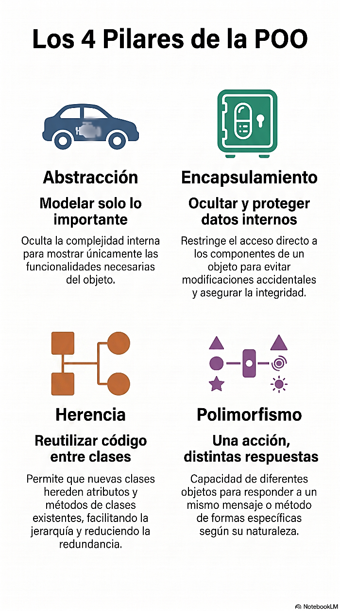

# POO: Objetos y Clases

> Modelando el mundo.

## ¿Por qué leemos este capítulo?

Hasta acá pensamos los programas como una serie de instrucciones que operan sobre datos: pedís algo, lo procesás, lo mostrás. Los datos por un lado (en variables, listas, diccionarios) y las acciones por otro (en funciones). Esto se llama **PARADIGMA IMPERATIVO**, y es exactamente lo que veníamos haciendo desde Programación 1 con C.

Ahora vamos a aprender otra forma de pensar, más cercana a cómo funciona el mundo real: **la PROGRAMACIÓN ORIENTADA A OBJETOS (POO)**. En POO no separamos datos y acciones, los combinamos en:

- **OBJETOS**, entidades que tienen un estado (lo que saben)
- y un **COMPORTAMIENTO** (lo que pueden hacer).

Este cambio no es cosmético. Es la razón por la que Django, PyGame, Pandas, y prácticamente cualquier librería moderna de Python funcionan como funcionan. Aprender POO no es aprender "otra forma de escribir lo mismo": es aprender el idioma en el que está escrito el **90% del código profesional que vas a leer en su vida**.

El capítulo es más largo que los anteriores. Es un cambio de mentalidad, y esos capítulos necesitan más explicación antes de que la sintaxis tenga sentido. Al final, empezamos un proyecto que va a acompañarnos por los próximos cinco capítulos: un sistema bancario.

## Del programa imperativo al programa orientado a objetos

Miremos el mismo problema resuelto en los dos paradigmas.

### Versión imperativa (lo que ya sabemos)

Queremos representar una cuenta bancaria con saldo, y poder depositar y extraer plata:

```python
# Estado: dos variables sueltas
titular = "Ana Pérez"
saldo = 1000

# Comportamiento: dos funciones que operan sobre esas variables
def depositar(saldo, monto):
    return saldo + monto

def extraer(saldo, monto):
    return saldo - monto

# Uso
saldo = depositar(saldo, 500)
saldo = extraer(saldo, 200)
print(f"{titular} tiene ${saldo}")
```

Funciona. Pero tiene problemas que se agravan a medida que el sistema crece:

- **Datos sueltos:** titular y saldo no están "unidos". Si tengo dos cuentas, tengo cuatro variables. Con 100 cuentas tengo 200 variables (o dos listas paralelas, que ya vimos que son un antipatrón).
- **Funciones desligadas:** depositar y extraer son funciones que operan sobre un saldo, pero nada las liga a la cuenta. Otro programador podría llamar depositar(saldo, "hola") y romper todo.
- **Sin protección:** cualquier parte del código puede hacer saldo = -999999 y no hay quien lo evite.

### Versión orientada a objetos

Ahora la misma idea, pero unificando estado y comportamiento en un **objeto**:

```python
class Cuenta:
    def __init__(self, titular, saldo):
        self.titular = titular
        self.saldo = saldo

    def depositar(self, monto):
        self.saldo += monto

    def extraer(self, monto):
        self.saldo -= monto

# Uso
cuenta_ana = Cuenta("Ana Pérez", 1000)
cuenta_ana.depositar(500)
cuenta_ana.extraer(200)
print(f"{cuenta_ana.titular} tiene ${cuenta_ana.saldo}")
```

No te preocupes si la sintaxis todavía no te dice nada. Fijate solo esto:

- titular y saldo viven **dentro** de cuenta_ana. Son parte del objeto.
- depositar y extraer también viven dentro del objeto.

Cuando llamás cuenta_ana.depositar(500), no hace falta pasarle el saldo: la cuenta ya conoce su propio saldo.

Si mañana necesitamos otra cuenta, cuenta_juan = Cuenta("Juan López", 500) es una línea. Cada una tiene su propio estado, independiente.

**Esto es POO en dos oraciones:**

Objetos que saben cosas y saben hacer cosas, todo junto.

## Los cuatro pilares de POO

Antes de meternos con la sintaxis en serio, conviene tener presente los cuatro **pilares** del paradigma. Los vas a ver mencionados en cualquier libro, curso o entrevista de trabajo. Los vamos a desarrollar uno por uno a lo largo de los próximos capítulos, pero acá los presentamos con palabras, sin código:



### Abstracción

Un objeto **oculta la complejidad** y te ofrece una interfaz simple. Cuando manejás un auto, girás el volante y apretás el pedal, no te importa cómo la caja de dirección multiplica el movimiento ni cómo el sistema de inyección regula el combustible. Esa es abstracción: te doy los botones que necesitás, el resto es asunto mío.

En nuestra cuenta bancaria: llamás cuenta.depositar(500) y ya. No sabés (ni te importa) si por adentro suma, escribe en un log, notifica a un servidor. **Ese es problema del objeto.**

### Encapsulamiento

Un objeto **protege sus datos**. No cualquiera puede meter la mano y cambiar el saldo directamente, hay que pasar por los métodos que el objeto expone, que son los que saben cómo hacerlo bien (validando, registrando, avisando).

Este pilar lo desarrollamos en el próximo capítulo, porque es donde POO empieza a mostrar músculo real. Por ahora, en este capítulo, todavía dejamos los atributos "al aire".

### Herencia

Un objeto puede **especializar a otro**. Si tengo una Cuenta genérica, puedo tener una CuentaAhorro que **es una Cuenta**, pero además paga intereses. La subclase hereda todo lo del padre y le agrega o modifica lo suyo. Evita copiar-pegar código.

### Polimorfismo

Distintos objetos pueden **responder al mismo mensaje de forma distinta**. Si a una CuentaAhorro, una CuentaCorriente y una CuentaSueldo les pedís resumen(), cada una devuelve el suyo, pero desde afuera las tratás igual. No hace falta preguntar "¿qué tipo de cuenta sos?" antes de pedir el resumen.

## Dos puentes conceptuales

Antes de meternos en sintaxis, dos analogías van a hacer que POO deje de ser "algo nuevo" y pase a ser "algo que ya venías haciendo con otro nombre".

### Puente 1: el diccionario que ya conocías

En Colecciones armamos cosas como esta:

```python
alumno = {
    "nombre": "Ana",
    "edad": 25,
    "carrera": "Ingeniería",
    "promedio": 8.5
}

def imprimir_alumno(alumno):
    print(f"{alumno['nombre']}, {alumno['edad']} años")

def subir_promedio(alumno, cantidad):
    alumno['promedio'] += cantidad
```

Un diccionario con datos + funciones que operan sobre él. Ahora comparalo con la versión OO:

```python
class Alumno:
    def __init__(self, nombre, edad, carrera, promedio):
        self.nombre = nombre
        self.edad = edad
        self.carrera = carrera
        self.promedio = promedio

    def imprimir(self):
        print(f"{self.nombre}, {self.edad} años")

    def subir_promedio(self, cantidad):
        self.promedio += cantidad
```

Es esencialmente lo mismo, pero:

- La estructura de datos y las funciones **están unidas** en una sola cosa.
- Ya no escribimos alumno['nombre'] (con corchetes y comillas), sino alumno.nombre (más directo, más rápido, más legible).
- Cada Alumno es un objeto independiente con su propia identidad.

Si ya te llevás bien con los diccionarios, POO no es un mundo nuevo: es una formalización más potente de lo que venías haciendo.

### Puente 2: teoría de conjuntos

Este puente les va a resultar familiar de Matemática. Los tres conceptos centrales de POO tienen equivalentes casi directos en la teoría de conjuntos que ya vieron:

| Teoría de conjuntos | POO |
| --- | --- |
| Conjunto | **Clase** |
| Elemento del conjunto | **Objeto** (instancia) |
| Propiedad/característica del elemento | **Atributo** |
| Operación aplicable a los elementos | **Método** |

Cuando definimos:

> **A = { x : x es una cuenta bancaria }**

Estamos definiendo un conjunto por comprensión: describimos qué propiedades tienen que cumplir los elementos para pertenecer al conjunto.

- Una clase Python es lo mismo, no es una cuenta concreta, sino la **descripción de qué es una cuenta**: qué atributos tiene
- qué operaciones acepta.

Y así como en el conjunto tenemos elementos concretos:

> **c₁, c₂, c₃ ∈ A**

En Python tenemos objetos concretos:

```python
cuenta_ana = Cuenta(...)      # c₁ ∈ Cuenta
cuenta_juan = Cuenta(...)     # c₂ ∈ Cuenta
cuenta_lucia = Cuenta(...)    # c₃ ∈ Cuenta
```

De hecho, Python tiene un operador para preguntar exactamente eso, si un objeto pertenece a una clase y se llama isinstance()…

```python
isinstance(cuenta_ana, Cuenta)     # True   cuenta_ana ∈ Cuenta
isinstance("hola", Cuenta)         # False  "hola" ∉ Cuenta
```

Y cuando en el capítulo 11 hablemos de **herencia**, van a ver que corresponde a la idea de **subconjunto**: si toda CuentaAhorro es una Cuenta, entonces **CuentaAhorro ⊂ Cuenta**, y todo lo que vale para el conjunto grande vale para el chico. Ese es el corazón del **principio de sustitución de Liskov** que vamos a formalizar en el capítulo 13.

No es una analogía, es literalmente la misma idea matemática, con notación de programación en vez de notación de conjuntos.

## Sintaxis mínima: definir una clase

Vamos a construir el objeto Cuenta paso a paso, viendo cada pieza.

### La palabra class

Una **clase** es la definición, el molde, el plano. Los **objetos** o **instancias** son las cosas concretas que se crean a partir del molde.

- **Clase:** el plano de un auto (existe uno solo).
- **Objetos:** los autos concretos fabricados a partir de ese plano (existen muchos).


En términos de conjuntos: la clase es el conjunto (definido por sus propiedades), los objetos son los elementos. Se define con la palabra reservada class:

```python
class Cuenta:
    pass    # placeholder: cuerpo vacío por ahora
```

### Convenciones importantes

- El **nombre de la clase va en PascalCase**: cada palabra empieza en mayúscula, sin guiones bajos. Cuenta, PersonaFisica, MovimientoBancario. Es diferente de las funciones y variables, que van en snake_case.
- El cuerpo va **indentado**, como cualquier bloque de Python.

Con esto solo, la clase ya existe y podemos crear objetos:

```python
mi_cuenta = Cuenta()
print(mi_cuenta)      # IMPRIME: <__main__.Cuenta object at 0x000001A2B3C4D5E0>
```

Ese mensaje raro significa: **"soy un objeto de tipo Cuenta que vive en tal lugar de la memoria"**. No tiene datos porque no le pusimos nada.

#### EJERCICIO

Definí una clase vacía llamada Persona. Creá tres objetos de esa clase (persona1, persona2, persona3) e imprimí cada uno. Comprobá con isinstance() que efectivamente son de tipo Persona.

```python
class Persona:
    pass                                   # (1)

persona1 = Persona()                        # (2)
persona2 = Persona()
persona3 = Persona()

print(persona1)                             # (3)  <__main__.Persona object at 0x...>
print(persona2)                             #      <__main__.Persona object at 0x...>
print(persona3)                             #      <__main__.Persona object at 0x...>

print(isinstance(persona1, Persona))        # (4)  True
print(isinstance("hola", Persona))          #      False
```

1. Definimos una clase (molde de objetos).
2. Creamos objetos o instancias de la clase (objetos fabricados con el molde).
3. Mostramos los objetos (pedimos que nos los muestren).
4. Preguntamos al objeto de qué clase es instancia.

Fijate que los tres objetos, aunque vienen de la misma clase, tienen direcciones de memoria distintas: son elementos distintos del mismo conjunto.

## El método __init__: el constructor

Cuando creás un objeto, Python llama automáticamente a un método especial llamado __init__ (**con dos guiones bajos a cada lado**, se lee "**dunder init**"). Es el **CONSTRUCTOR**: la función que corre en el momento del nacimiento del objeto, cuya única razón de existir es dejarlo con estado inicial válido, o sea crearlo de la manera que queramos.


Ahora que tenemos el molde, podemos crear objetos. Claro, tenemos que decirle como serán. Por ejemplo, puedo tener un molde de auto. Ahora si quiero un auto, de ese molde, le tengo que decir sus atributos como de qué color lo quiero.

Cuenta tiene dos atributos, titular y saldo, al crear una cuenta le tengo que dar un titular y un saldo.

```python
cuenta_ana = Cuenta("Ana Pérez", 1000)
print(cuenta_ana.titular)    # Ana Pérez
print(cuenta_ana.saldo)      # 1000
```

Fijate qué pasó en la línea cuenta_ana = Cuenta("Ana Pérez", 1000):

Python crea un objeto nuevo, vacío, de tipo Cuenta.

- Llama a __init__ sobre ese objeto, pasándole "Ana Pérez" y 1000.
- Dentro del __init__, el objeto recién creado se llama self. Le colgamos .titular y .saldo como atributos.
- Al terminar el __init__, el objeto está listo y se guarda en cuenta_ana.

### EJERCICIO 1

Definí una clase Producto con atributos nombre y precio, inicializados desde el constructor. Creá dos productos e imprimí sus atributos.

*Ver código en el archivo `.py` correspondiente.*

Cada producto es un objeto independiente con sus propios atributos, aunque los dos vengan de la misma clase.

### El parámetro self

Este es el concepto que más cuesta al principio, así que vamos despacio.

**self es el objeto en el que se está trabajando**. Cuando escribís cuenta_ana.depositar(500), Python traduce eso internamente a Cuenta.depositar(cuenta_ana, 500), le pasa la propia cuenta como primer argumento del método.

## Métodos: def

Define el comportamiento de los objetos de cada clase. El primero método es su propia creación y ya lo vimos, el constructor del __init__(self, Atributo1, Atributo2, …, AtributoN)

Ahora nos preguntamos: Tengo un molde para construir un auto, pero ¿Cuál es su comportamiento? Un auto se enciende, acelera, frena, dobla…


Cada comportamiento se define con un método. Cada método “realiza” ese comportamiento de cada objeto.

Por eso todos los métodos de la clase reciben self como primer parámetro. Es la forma que tiene el método de saber sobre **qué objeto concreto** estás trabajando.

```python
class Cuenta:
    def __init__(self, titular, saldo):
        self.titular = titular       # "en este objeto, guardá titular"
        self.saldo = saldo           # "en este objeto, guardá saldo"

    def depositar(self, monto):
        self.saldo += monto          # "sumale monto al saldo DE ESTE objeto"
```

self es solo una convención de nombre, no una palabra reservada. Podrías llamarlo este o x. Pero por convención universal en Python, **siempre se llama** self, y cambiar eso confunde a cualquiera que lea tu código. No lo cambies.

### Comportamiento del objeto

Los **métodos** son funciones que viven adentro de una clase. Se definen igual que las funciones normales (con def), pero con self como primer parámetro:

```python
class Cuenta:
    def __init__(self, titular, saldo):
        self.titular = titular
        self.saldo = saldo

    def depositar(self, monto):
        self.saldo += monto

    def extraer(self, monto):
        self.saldo -= monto

    def informar_saldo(self):
        print(f"{self.titular} tiene ${self.saldo}")
```

Ya tenemos el molde armado (la clase). Ahora creamos un objeto (instancia de clase) al que llamamos cuenta_ana y para eso les pasamos valores, los que usan def __init__() para crear ese objeto. Una vez creado el objeto este tiene un comportamiento definido por sus métodos. Eso quiere decir, tenemos el objeto y le mandamos mensajes con el formato de objeto.mensaje

¿Y cómo sabe el objeto cómo comportarse? Por la definición de los métodos. Nosotros, al mandarle un mensaje al objeto ¿Es necesario saber cómo lo hace? Abstracción:

```python
cuenta_ana = Cuenta("Ana Pérez", 1000)
cuenta_ana.depositar(500)          # saldo pasa a 1500
cuenta_ana.extraer(200)             # saldo pasa a 1300
cuenta_ana.informar_saldo()         # Ana Pérez tiene $1300
```

Fijate que cuando llamás el método **no pasás** self: Python lo hace por vos. cuenta_ana.depositar(500) es todo lo que escribís, Python se encarga de decirle al método "el self es cuenta_ana".

### EJERCICIO 2

Creá una clase Alumno con atributos nombre, edad y promedio. Agregale un método presentarse() que imprima algo como *"Soy Ana, tengo 22 años y mi promedio es 8.5"*. Después creá dos alumnos distintos y hacé que cada uno se presente.

```python
class Alumno:
    def __init__(self, nombre, edad, promedio):
        self.nombre = nombre
        self.edad = edad
        self.promedio = promedio

    def presentarse(self):
        print(f"Soy {self.nombre}, tengo {self.edad} años y mi promedio es {self.promedio}")

ana = Alumno("Ana", 22, 8.5)
juan = Alumno("Juan", 25, 7.2)

ana.presentarse()      # Soy Ana, tengo 22 años y mi promedio es 8.5
juan.presentarse()     # Soy Juan, tengo 25 años y mi promedio es 7.2
```

ana y juan son **dos objetos independientes**. Cada uno tiene sus propios atributos. Cuando ana.presentarse() accede a self.nombre, encuentra "Ana" cuando juan.presentarse() accede a self.nombre, encuentra "Juan". El mismo método se comporta distinto según el objeto sobre el que se llama.

### Métodos que modifican estado vs métodos que consultan

Hay dos grandes categorías de métodos:

- Los que **modifican** el estado del objeto (depositar, extraer, subir_promedio): cambian atributos, generalmente no devuelven nada.
- Los que **consultan** el estado (informar_saldo, presentarse): calculan algo o muestran algo, sin tocar el objeto.

No es una regla estricta de Python, es una convención de diseño. Los métodos que consultan y devuelven un valor suelen empezar con verbos como obtener_, calcular_, es_, tiene_. Los que modifican suelen ser imperativos: agregar, depositar, actualizar.


### EJERCICIO 3

Ampliá la clase Producto(nombre, precio) agregándole stock (que arranca en 0). Sumale dos métodos: reponer(cantidad) que aumenta el stock, y valor_stock() que devuelve precio * stock. Uno modifica, el otro solo consulta.

*Ver código en el archivo `.py` correspondiente.*

Fijate el detalle importante: **no todos los atributos vienen del** __init__. stock empieza siempre en 0, es parte del estado inicial que la clase decide sola, no algo que reciba desde afuera.

## Cómo Python muestra un objeto: __str__

Volvamos a probar imprimir el objeto directo:

```python
cuenta_ana = Cuenta("Ana Pérez", 1000)
print(cuenta_ana)
# <__main__.Cuenta object at 0x000001A2B3C4D5E0>
```

Ese mensaje ilegible es lo que Python muestra por defecto cuando no le decimos qué queremos ver. Podemos cambiar eso definiendo un método especial llamado __str__, que Python invoca automáticamente cuando el objeto va a convertirse en texto:

```python
class Cuenta:
    def __init__(self, titular, saldo):
        self.titular = titular
        self.saldo = saldo

    def depositar(self, monto):
        self.saldo += monto

    def extraer(self, monto):
        self.saldo -= monto

    def __str__(self):
        return f"Cuenta de {self.titular}: ${self.saldo}"
```

Ahora:

```python
cuenta_ana = Cuenta("Ana Pérez", 1000)
print(cuenta_ana)            # Cuenta de Ana Pérez: $1000
print(f"{cuenta_ana}")       # Cuenta de Ana Pérez: $1000
```

__str__ es el primero de varios **métodos "dunder"** (double underscore) que Python usa detrás de escena. Su función es siempre la misma: **enseñarle al objeto cómo comportarse cuando lo tratás como algo estándar**. En este caso, cómo mostrarse como texto.

Más adelante vamos a ver __eq__ (cómo compararse con ==), __len__ (qué devolver ante len()), y otros.

**Regla práctica:**

Toda clase que vas a mostrar por consola merece un __str__. Es una de las cosas más simples que podés hacer para que tu código se sienta profesional.

### EJERCICIO 4

Agregale un __str__ a la clase Alumno que hiciste antes, de manera que print(ana) muestre "Alumno: Ana (22 años, promedio 8.5)". Después probalo.

*Ver código en el archivo `.py` correspondiente.*

Notá algo importante: __str__ **devuelve** un string (con return), no lo imprime. Es Python quien después decide qué hacer con ese string: imprimirlo, guardarlo en una variable, meterlo en un f-string. __str__ solo dice **cómo se representa el objeto como texto**.

## Objetos como valores independientes

Un detalle que a veces confunde al principio: cuando creás dos objetos de la misma clase, son **completamente independientes**. Modificar uno no afecta al otro.

```python
cuenta_ana = Cuenta("Ana", 1000)
cuenta_juan = Cuenta("Juan", 500)

cuenta_ana.depositar(300)

print(cuenta_ana)     # Cuenta de Ana: $1300
print(cuenta_juan)    # Cuenta de Juan: $500 no cambió
```

Cada objeto tiene su propio self.saldo, su propio self.titular. Son cajas separadas que casualmente tienen la misma forma (porque salen del mismo molde), pero cada una con su contenido.

Este comportamiento es lo que hace que POO escale a sistemas grandes. Podés tener miles de cuentas en el mismo programa, cada una con su estado, y las operaciones sobre una no afectan a las otras.

En términos de conjuntos: dos elementos distintos del mismo conjunto tienen las mismas propiedades declaradas, pero pueden asignarles valores distintos. c₁ y c₂ son ambos cuentas, pero saldo(c₁) ≠ saldo(c₂) es perfectamente válido.

## Comparación con C: por qué es distinto

En C existían las struct, que agrupaban datos:

```c
struct Cuenta {
    char titular[100];
    float saldo;
};
```

Y podías hacer funciones que operaban sobre un struct:

```c
void depositar(struct Cuenta *c, float monto) {
    c->saldo += monto;
}
```

Se parece. Pero:

- El struct de C solo **agrupa datos**. Las funciones son cosa aparte, nada las liga a la estructura.
- En Python, la clase **agrupa datos Y funciones**. depositar "vive dentro" del objeto: no hay forma de tener un objeto Cuenta sin sus métodos.
- En C, para llamar depositar había que acordarse de pasarle el puntero al struct. En Python, cuenta.depositar(500) se encarga solo.

POO no es "structs con funciones al lado". Es una forma diferente de organizar el programa, con consecuencias importantes que vamos a ver en los próximos capítulos: encapsulamiento, herencia, polimorfismo.
