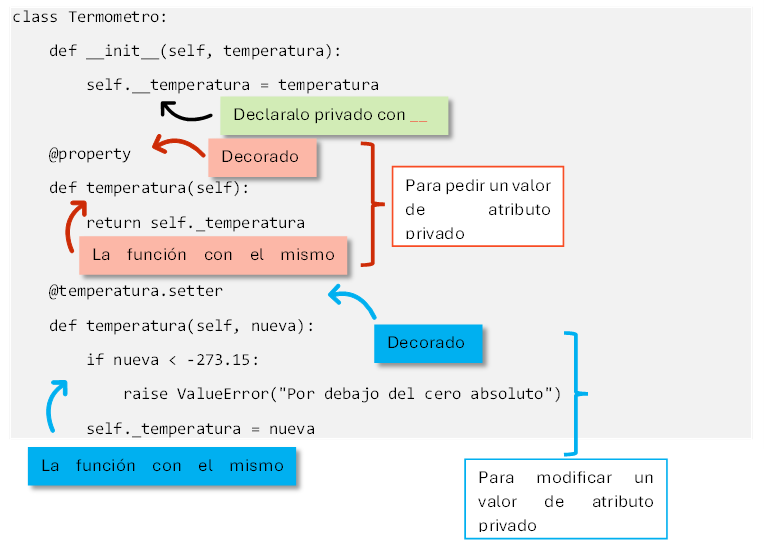
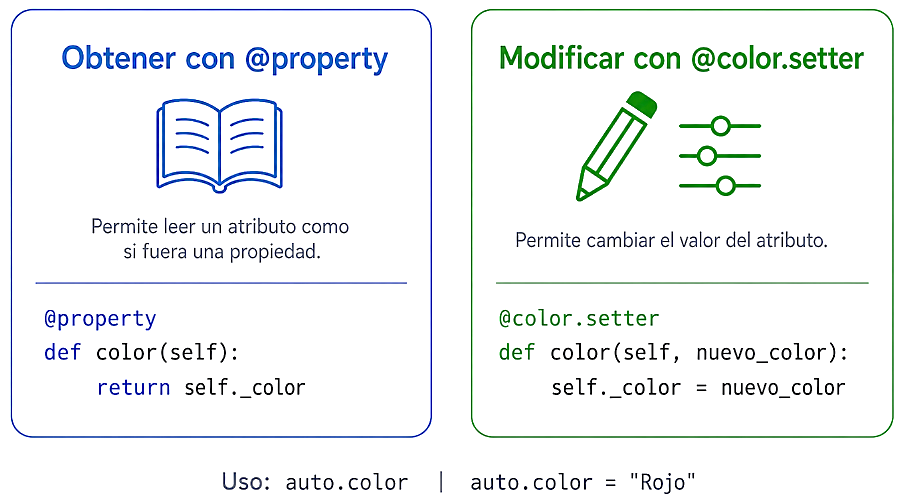
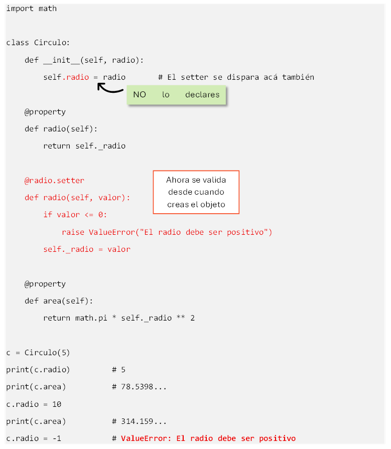

# POO: Encapsulamiento y validación

_Especializando comportamiento._

## ¿Por qué leemos este capítulo?

En el capítulo anterior armamos la primera Cuenta. Andaba, hacía lo suyo, tenía métodos, tenía __str__. Pero al final vimos que estaba llena de agujeros: aceptaba depósitos negativos, dejaba el saldo en rojo, permitía que cualquiera cambiara cuenta.saldo por afuera. Era un **contenedor pasivo**: guardaba datos y ejecutaba operaciones sin cuestionar nada.

Este capítulo la convierte en una **guardiana activa** de sus propios datos. Vamos a introducir tres ideas centrales:

- **Atributos privados**: la convención pythónica para decir "esto no se toca desde afuera".
- **Properties**: la forma elegante de exponer atributos con reglas propias.
- **Excepciones personalizadas**: nombres específicos para los errores de tu dominio, en vez de reutilizar los genéricos.

Todo esto es el pilar de **encapsulamiento** que anticipamos en el capítulo 9. Ahora sí lo vemos en detalle, y con un dominio concreto: el banco.

Como bonus, todas las funciones de validación de string que aprendieron sueltas (isdigit, isspace, isalpha, strip) vuelven acá, pero organizadas como responsabilidad de la clase. Antes las usaban en un script suelto, ahora viven adentro del objeto que se encarga de validarse a sí mismo.

A lo largo del capítulo vas a encontrar mini-ejercicios resueltos en el momento. Al final hay 20 integradores para resolver por tu cuenta y la iteración 2 del proyecto bancario.

## Por qué "privado": el problema del acceso libre

Miremos un ejemplo genérico. Una clase Termometro que mide temperatura:

```python
class Termometro:
    def __init__(self, temperatura):
        self.temperatura = temperatura

    def calibrar(self, ajuste):
        self.temperatura += ajuste
```

Alguien la usa:

```python
t = Termometro(25)
t.calibrar(0.5)              # OK
t.temperatura = -500         # esto también funciona
```

Nada nos protege de la última línea. La clase declaró un método calibrar para modificar la temperatura con reglas, pero cualquier código de afuera puede saltárselo y escribir directamente en t.temperatura. Y en el mundo real, una temperatura de -500°C es imposible: el cero absoluto está en -273.15°C. **Es como poner una puerta blindada al lado de una pared de cartón.**

Esto no es problema en programas de laboratorio, donde el código lo escribís vos y sos responsable. Pero cuando el código lo escriben veinte personas distintas, cuando el objeto viaja por un sistema grande, o cuando un año más tarde tenés que agregar reglas (registrar en un log cada modificación, avisar al usuario), necesitás que **todo pase por los métodos**. Sin excepciones.

El concepto que resuelve esto se llama **ENCAPSULAMIENTO**: unificar datos y comportamiento, y proteger los datos de accesos indebidos.

## La convención del guion bajo

En algunos lenguajes (Java, C#, C++) existe la palabra private para declarar que un atributo no puede tocarse desde afuera. **Python no tiene esa palabra**. Lo que tiene es una convención que todos los programadores Python respetamos: **si un atributo empieza con guion bajo, es privado**.

```python
class Cuenta:
    def __init__(self, titular, saldo):
        self.titular = titular
        self._saldo = saldo      # guion bajo: "no me toques desde afuera"
```

Ese _saldo técnicamente sigue siendo accesible. Podés hacer cuenta._saldo = 99999999 y funciona. Pero es un mensaje claro:

*"si me tocás por acá, sabé que estás rompiendo el contrato de la clase, y las consecuencias son tuyas"*.

Es como una habitación con un cartel que dice "privado, no entrar": no está trabada con llave, pero pasás igual y cualquiera te va a decir que estás violando la regla.

### Un guion bajo vs. dos

Hay un segundo nivel: **dos guiones bajos**. Se llama ***name mangling*** (mutilación de nombre) y hace que Python renombre internamente el atributo para hacerlo verdaderamente difícil de acceder desde afuera:

```python
class Cuenta:
    def __init__(self, titular, saldo):
        self.titular = titular
        self.__saldo = saldo     # doble guion bajo

cuenta = Cuenta("Ana", 1000)
cuenta.__saldo         # AttributeError: 'Cuenta' object has no attribute '__saldo'
```

Python internamente lo guarda como _Cuenta__saldo, así que el acceso directo por el nombre original falla. En la práctica, **casi no se usa**. La convención de un guion bajo es suficiente para el **99% de los casos** y no rompe la ergonomía. El **doble guion bajo se reserva para casos específicos** (evitar colisiones en herencia, principalmente).

En este manual vamos a usar **un guion bajo** para todos los atributos privados.

### Ejercicio 1


Modificá la clase Persona del capítulo anterior (nombre, edad) para que la edad sea privada (_edad). Después probá acceder a persona._edad desde afuera y comprobá que funciona técnicamente, pero rompe el contrato.

```python
class Persona:
    def __init__(self, nombre, edad):
        self.nombre = nombre
        self._edad = edad          # privado por convención

    def cumplir_años(self):
        self._edad += 1

ana = Persona("Ana", 25)
print(ana._edad)          # 25 Python lo permite
ana._edad = 999           # también lo permite, pero rompe el contrato
print(ana._edad)          # 999
```

El acceso técnicamente funciona. El editor (VSCode, PyCharm) probablemente te subraye la línea como advertencia. Y cualquier reviewer de código te va a marcar que estás violando la convención.

## Getters y setters: la primera reacción, no la mejor

Si el atributo es privado, ¿cómo hago para consultarlo o modificarlo desde afuera? Primera reacción, viniendo de otros lenguajes: **métodos getter y setter**.

```python
class Termometro:
    def __init__(self, temperatura):
        self._temperatura = temperatura

    def get_temperatura(self):
        return self._temperatura

    def set_temperatura(self, nueva):
        if nueva < -273.15:
            raise ValueError("Por debajo del cero absoluto")
        self._temperatura = nueva
```

Y desde afuera:

```python
t = Termometro(25)
print(t.get_temperatura())         # 25
t.set_temperatura(30)              # OK
t.set_temperatura(-500)            # ValueError: Por debajo del cero absoluto
```

Funciona. Pero en Python **no es la forma idiomática**. En Java o C# los getters y setters son estándar, pero Python tiene una herramienta mejor que veremos en un momento.

Antes de eso, entendé el mecanismo: es la misma idea de la validación en raise ValueError del capítulo de errores, ahora dentro de un método. Cada vez que alguien quiere cambiar la temperatura, pasa por set_temperatura, y el método decide si permite el cambio o rechaza con una excepción.

## Properties: la forma pythónica

Python tiene un mecanismo que permite **usar la sintaxis de atributo normal, pero con lógica de método por debajo**. Se llama **property**, y se marca con el decorador @property cuando querés leer el valor de un atributo privado, o @atributo.setter cuando querés darle valor.



Y ahora desde afuera se usa como si fuera un atributo cualquiera:

```python
t = Termometro(25)
print(t.temperatura)         # 25    sin paréntesis, como atributo
t.temperatura = 30           # OK
t.temperatura = -500         # ValueError: Por debajo del cero absoluto
```

Fijate la magia:

- t.temperatura se ve como acceso a atributo, **pero por debajo llama al método getter** (el marcado con @property).
- t.temperatura = 30 se ve como asignación, **pero por debajo llama al setter** (el marcado con @temperatura.setter), que ejecuta la validación.

Este es el idiom pythónico:

> Exponer atributos con sintaxis simple, pero con protección real por debajo.



Los que vienen de Java o C++ suelen desconfiar al principio: "pero ¿Cómo no tiene paréntesis y aun así valida?", y ese es exactamente el punto, el usuario de la clase escribe menos, no tiene que recordar get_temperatura() vs set_temperatura(), y aun así la clase se defiende.

### Sintaxis del decorador

Un **decorador** es una anotación que va antes de un def, empieza con @, y modifica el comportamiento del método que le sigue. Los que necesitás por ahora:

- **@property**: convierte el método en el **getter** de una propiedad. El nombre del método pasa a ser el nombre público del atributo.
- **@nombre.setter**: define el **setter** correspondiente. nombre tiene que ser el mismo que usaste con @property.

Los decoradores como concepto general son un tema avanzado que no vamos a profundizar. Por ahora te alcanza con saber que @property y @nombre.setter son las dos anotaciones que necesitás para las properties.

### Property de solo lectura

Si solo definís el @property (sin setter), el atributo queda **de solo lectura**: se puede leer, pero cualquier intento de asignarle un valor da error.

```python
class Empleado:
    def __init__(self, legajo, nombre):
        self._legajo = legajo
        self._nombre = nombre

    @property
    def legajo(self):
        return self._legajo
    # sin @legajo.setter ➡ legajo es de solo lectura

    @property
    def nombre(self):
        return self._nombre

emp = Empleado("E-2001", "Ana Pérez")
print(emp.legajo)         # E-2001
emp.legajo = "E-9999"     # AttributeError: property 'legajo' of 'Empleado' object 
 				# has no setter
```

Esto tiene sentido para atributos que **no deberían cambiar durante la vida del objeto**: el titular original de la cuenta, el número de DNI, la fecha de nacimiento. Se establecen en el __init__ y no se tocan más.

### Encapsulamiento

Encapsulamiento es que la clase sea dueña de sus datos: los guarda como privados (_saldo) y decide qué se puede leer y qué se puede modificar. Con @property sin setter, exponés un atributo de solo lectura: se consulta como cuenta.saldo, pero cualquier intento de asignarle un valor (cuenta.saldo = 999) falla. El dato es visible pero no editable, la única forma de cambiarlo es pasar por los métodos que la clase te ofrece (depositar, extraer), que son los que aplican las reglas del dominio.

### Ejercicio 2


> El código lo podés encontrar en `ejercicio_2.py`.

Hacé una clase Circulo con un atributo _radio privado. Exponé radio como property con setter que rechace valores negativos o cero (lanzando ValueError). Además, exponé area como property de solo lectura que devuelva π * radio².



Fijate un detalle poderoso:

Dentro del __init__ escribimos self.radio = radio, no self._radio = radio. Eso hace que **la validación se dispare también al construir el objeto**. Si alguien intenta Circulo(-5), el setter rechaza en el __init__ y el objeto ni siquiera termina de crearse. Es un idiom central: **usar el setter dentro del `__init__` para que la validación funcione desde el nacimiento**.

También notá area como property sin setter: no es un dato, es un valor calculado, y no tiene sentido asignarle nada. Se accede como si fuera un atributo (c.area, sin paréntesis) aunque por debajo hay una fórmula.

## Validación en el __init__

El __init__ es la puerta de entrada del objeto. Es el lugar natural para rechazar la creación de objetos inválidos. Un objeto que llegó al mundo con datos malos va a arrastrar problemas hasta el final.

**Regla clave:**

> Si un objeto no puede estar en estado válido, no debería existir. La construcción falla y punto.

```python
class Empleado:
    def __init__(self, nombre, sueldo=0):
        if not isinstance(nombre, str):
            raise TypeError("El nombre debe ser un string")
        nombre_limpio = nombre.strip()
        if not nombre_limpio:
            raise ValueError("El nombre no puede estar vacío")
        if sueldo < 0:
            raise ValueError("El sueldo no puede ser negativo")

        self._nombre = nombre_limpio
        self._sueldo = sueldo
```

Fijate cómo se combinan varias herramientas que ya viste:

- isinstance(nombre, str): verifica que **el tipo** sea correcto. Si me pasan un número donde esperaba string, lanzo TypeError.
- nombre.strip() + not nombre_limpio: limpia espacios y verifica que **no quede vacío**. Si me pasan " " (solo espacios), después de strip() queda "", que es falsy y falla la validación.
- sueldo < 0: verifica **el rango** del valor. Si es negativo, lanzo ValueError.

Cada tipo de error tiene su excepción específica. Ese es el criterio que ya vimos:

- **TypeError** - el tipo es incorrecto (recibiste algo distinto de lo esperado).
- **ValueError** - el tipo es correcto pero el valor está mal.

Podés preguntarte: *"¿por qué no tirar todo con Exception genérica?"*. Porque el que atrapa después va a querer distinguir. Si me pasan sueldo = -100, el usuario cometió un error de dato, si me pasan sueldo = "hola", el error es más grave (el programa lo llamó mal). Poder diferenciar los dos casos con except ValueError: vs except TypeError: es lo que hace que el código sea mantenible.

### Ejercicio 3


Crea una clase Producto con nombre (string no vacío), precio (número positivo, cero incluido) y stock (entero mayor o igual a cero). Validá todo en el __init__. Además, precio y stock deben ser properties con setters que también validen.

> El código lo podés encontrar en `ejercicio_3.py`.

Fijate cómo el __init__ usa self.precio = precio (con property, no self._precio) para aprovechar la validación del setter. Si mañana cambia la regla de precio, se toca en un solo lugar (el setter) y afecta a todos los usos, incluido el __init__. Es un idiom central de POO: **no duplicar lógica de validación**.

## Excepciones personalizadas: los errores de tu dominio

Hasta ahora usamos las excepciones que Python ya trae: ValueError, TypeError, ZeroDivisionError. Están bien para errores genéricos. Pero cuando el dominio de tu programa tiene errores específicos, es más claro **crear excepciones propias** con nombres significativos.

Un ejemplo típico:

*En un sistema de contraseñas, una clave demasiado corta es un tipo específico de error. `ValueError` no lo describe con precisión, podría venir de mil cosas. Ideal: una excepción propia llamada `ClaveDebilError`.*

```python
class ClaveDebilError(Exception):
    """Se lanza cuando una contraseña no cumple los requisitos mínimos."""
    pass
```

Eso es todo. Una clase que hereda de Exception (la clase base de todas las excepciones de Python), con nombre descriptivo. El pass significa "**no agrego nada nuevo, alcanza con lo que hereda de Exception**".

Ahora podés lanzarla en tus métodos:

```python
class Password:
    def __init__(self, valor):
        if len(valor) < 8:
            raise ClaveDebilError(
                f"La clave tiene {len(valor)} caracteres, se requieren al menos 8"
            )
        self._valor = valor
```

Y quien la usa la atrapa por nombre:

```python
try:
    p = Password("abc")
except ClaveDebilError as e:
    print(f"Rechazada: {e}")
```

Este except solo atrapa el error de clave débil. Si la creación fallara por otro motivo (tipo incorrecto, valor None), la excepción sería otra (TypeError, AttributeError) y este except no la vería.

### ¿Por qué esto es mejor que ValueError?

Tres razones concretas:

- **Legibilidad**: el nombre de la excepción documenta el error. SaldoInsuficienteError se explica solo, ValueError requiere leer el mensaje para saber qué pasó.
- **Precisión en el try/except**: podés atrapar exactamente el error que sabés manejar, sin atrapar por accidente errores parecidos. Con ValueError corrés el riesgo de tragarte errores no relacionados.
- **Escalabilidad**: si más adelante querés distinguir *saldo insuficiente* de *cuenta bloqueada* de *límite diario superado*, ya tenés la estructura para agregar más excepciones. ValueError para todo no escala.

Nota importante: la convención en Python es que **los nombres de las excepciones terminan con "Error"**. SaldoInsuficienteError, no SaldoInsuficiente. Es parte del contrato de estilo y ayuda a que el código se lea como en inglés técnico.

### Ejercicio 4


Creá una excepción StockInsuficienteError. Después modificá la clase Producto del ejercicio anterior para que tenga un método vender(cantidad) que reste del stock si hay suficiente, o lance la excepción si no. Probá los dos casos.

> El código lo podés encontrar en `ejercicio_4.py`.

Fijate cómo el mensaje de la excepción es **específico y con datos** (cuánto se intentó, cuánto había), no un genérico "operación inválida". Cuanto más informativo el mensaje, más fácil el debugging.

## Encapsulamiento en acción: la Cuenta renovada

Juntemos todo en un ejemplo integrador. Vamos a construir una clase Empleado con:

- Datos privados y properties.
- Validación en el __init__.
- Un método de negocio (aumentar_sueldo) que valida su argumento.
- Una excepción propia para un caso específico del dominio.


Ahora probemos las cosas que sin encapsulamiento hubieran pasado sin control:

```python
# Aumento negativo, rechazado
try:
    emp = Empleado("E-001", "Ana Pérez", 500000)
    emp.aumentar_sueldo(-10)
except AumentoInvalidoError as e:
    print(f"Rechazado: {e}")

# Aumento absurdo, rechazado
try:
    emp.aumentar_sueldo(500)
except AumentoInvalidoError as e:
    print(f"Rechazado: {e}")

# Modificación directa del sueldo, rechazada
try:
    emp.sueldo_basico = 99999999
except AttributeError as e:
    print(f"No se puede modificar el sueldo directamente: {e}")

# Creación inválida, rechazada
try:
    Empleado("", "", -1000)
except ValueError as e:
    print(f"Empleado inválido: {e}")

# Uso normal
emp.aumentar_sueldo(15)
print(emp)     # [E-001] Ana Pérez - Sueldo: $575000.00
```

Cada uno de esos casos que sin encapsulamiento hubiera pasado sin decir nada ahora **falla ruidosamente y con motivo**. La clase se defiende sola, no importa quién la esté usando: nadie puede meter un aumento absurdo, ni tocar el sueldo por afuera, ni construir un empleado con datos inválidos.

## Docstrings en clases

Cuando una clase crece, necesita documentación. La convención en Python es usar **docstrings** (el mismo mecanismo que vimos con funciones) para la clase completa y para cada método.

```python
class Empleado:
    """Empleado del sistema de RRHH con encapsulamiento y validación.

    Los atributos son privados y se exponen como properties de solo
    lectura. El sueldo solo puede modificarse mediante el método
    aumentar_sueldo(), que valida sus argumentos.

    Attributes:
        legajo: Identificador único del empleado (solo lectura).
        nombre: Nombre completo del empleado (solo lectura).
        sueldo_basico: Sueldo actual (solo lectura, se modifica vía métodos).

    Raises:
        ValueError: Si algún dato de creación es inválido.
        TypeError: Si el tipo de algún argumento es incorrecto.
    """

    def __init__(self, legajo, nombre, sueldo_basico):
        """Crea un nuevo empleado con datos validados.

        Args:
            legajo: String no vacío con el identificador.
            nombre: String no vacío con el nombre del empleado.
            sueldo_basico: Número no negativo.
        """
        # ... implementación ...

    def aumentar_sueldo(self, porcentaje):
        """Aumenta el sueldo en un porcentaje dado.

        Args:
            porcentaje: Número positivo, no mayor a 100.

        Raises:
            TypeError: Si `porcentaje` no es numérico.
            AumentoInvalidoError: Si `porcentaje` es negativo o supera 100.
        """
        # ... implementación ...
```
