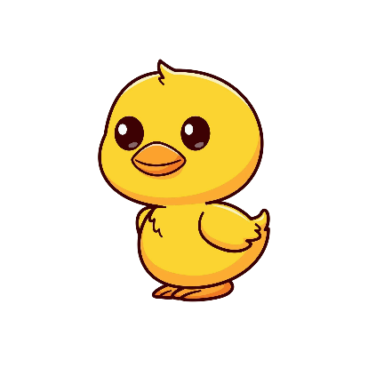

# POO: Herencia y polimorfismo

_Especializando comportamiento._

## ¿Por qué leemos este capítulo?

En el capítulo anterior armamos una `Cuenta` que se defiende sola. Anda muy
bien, pero tiene un problema: en un banco real no existe una sola clase de
cuenta. Hay cajas de ahorro (que pagan intereses), cuentas corrientes (que
permiten descubierto hasta un límite), cuentas sueldo (que tienen reglas
propias). Comparten mucho —todas tienen titular, saldo, depósito,
extracción— pero cada una agrega o cambia comportamientos.

Podríamos hacer tres clases separadas, `CuentaAhorro`, `CuentaCorriente` y
`CuentaSueldo`, cada una repitiendo el `__init__`, los depósitos, las
extracciones y las validaciones. Al primer cambio (querer normalizar el
número de cuenta con un formato distinto, por ejemplo) habría que tocar tres
lugares. Peor: si mañana agregamos `CuentaEmpresa`, otra vez a copiar todo.

La **herencia** resuelve exactamente esto: una clase toma como base a otra y
agrega o modifica solo lo que la hace distinta. El código común vive una sola
vez, en el padre. Cada hija se limita a especializar.

Y una vez que tenés varias clases relacionadas, aparece la segunda idea del
capítulo: el **polimorfismo**. Es la capacidad de tratar objetos de distintos
tipos de manera uniforme, siempre que compartan una interfaz común. Podés
recorrer una lista con cuentas de todos los tipos y llamar `resumen()` sobre
cada una. Cada una responde a su manera, sin que el código exterior tenga que
preguntar de qué tipo es cada objeto.

Con estos dos pilares completamos los cuatro de POO: abstracción,
encapsulamiento, herencia y polimorfismo. El próximo capítulo (composición)
los combina en sistemas más grandes; el que sigue (SOLID) los eleva a
principios de diseño. Al final de este capítulo vamos a volver a la jerarquía
de cuentas que acabamos de prometer y la vamos a construir entera.

## Herencia: sintaxis básica

Volvamos al puente conceptual con teoría de conjuntos. En el capítulo 9
dijimos que una clase es un conjunto. La herencia corresponde a la idea de
subconjunto:

```
CuentaAhorro ⊂ Cuenta
```

Toda cuenta de ahorro es una cuenta. Todo lo que puede hacer una cuenta
genérica puede hacerlo una cuenta de ahorro. Pero además la cuenta de ahorro
tiene sus propias reglas específicas (tasa de interés, por ejemplo). En
términos matemáticos: las cuentas de ahorro son elementos de un conjunto más
chico, **con propiedades adicionales**.

En Python esto se expresa poniendo la **clase padre entre paréntesis** al
declarar la hija:

```python
class Vehiculo:
    def __init__(self, marca, velocidad_maxima):
        self._marca = marca
        self._velocidad_maxima = velocidad_maxima

    def acelerar(self, cantidad):
        print(f"Acelerando {cantidad} km/h")

    def informar(self):
        print(f"Marca: {self._marca}")


class Auto(Vehiculo):     # Hereda de Vehiculo
    pass
```

Con solo escribir `class Auto(Vehiculo): pass` ya tenemos una clase
completamente funcional:

```python
auto = Auto("Ford", 200)
auto.acelerar(20)     # Acelerando 20 km/h
auto.informar()       # Marca: Ford
```

Sin haber escrito un solo `def` en `Auto`, ya tiene `__init__`, `acelerar` e
`informar`. Los heredó de `Vehiculo`. Ese es el poder de la herencia:
**reutilización sin duplicación**.

Fijate que para ver la marca llamamos a `informar()` y no leemos
`auto._marca` desde afuera. El guion bajo sigue significando lo mismo que en
el capítulo 10: ese atributo es asunto interno de la clase. La herencia no
suspende el encapsulamiento; la hija sí puede tocar los atributos protegidos
del padre, el código de afuera no.

### Vocabulario

Un momento para fijar los términos:

- **Clase padre** (o superclase, o base): la que otra hereda. Acá `Vehiculo`.
- **Clase hija** (o subclase, o derivada): la que hereda. Acá `Auto`.
- **Herencia**: la relación entre ellas. `Auto` "es un" `Vehiculo`.

La forma más rápida de decidir si tenés que usar herencia es la prueba del
**"es un(a)"**:

- ¿Un `Auto` **es un** `Vehiculo`? Sí. Herencia.
- ¿Un `Auto` **tiene un** `Motor`? Otra cosa: composición, capítulo 12.

### La relación "es un" en Python

Python tiene una función para preguntar exactamente eso:

```python
auto = Auto("Ford", 200)

isinstance(auto, Auto)        # True
isinstance(auto, Vehiculo)    # True, también es un Vehiculo
isinstance(auto, str)         # False
```

Notá el segundo caso: `auto` es al mismo tiempo un `Auto` y un `Vehiculo`.
Ambas cosas son verdaderas simultáneamente, exactamente como en teoría de
conjuntos: un elemento de un subconjunto también pertenece al conjunto
grande. Esta es la base del polimorfismo, que vemos en un rato.

> **Toda clase hereda de `object`.**
> Cuando escribís `class Vehiculo:` sin paréntesis, Python entiende
> `class Vehiculo(object):`. `object` es la raíz de la jerarquía: todo objeto
> de Python desciende de ella. Por eso `isinstance(auto, object)` da `True`,
> y por eso todo objeto ya tiene `__str__`, `__repr__` y `__eq__` aunque vos
> no los hayas escrito. Cuando definís tu propio `__str__`, en realidad
> estás **sobrescribiendo** el que heredaste de `object`. Tenerlo presente
> evita confusiones más adelante.

---


> **EJERCICIO 1** — Definí una clase `Animal` con un método `respirar()` que
> imprima `"Respirando..."`. Después definí `Perro(Animal)` sin agregar nada.
> Creá un perro y hacelo respirar. Comprobá con `isinstance` que es al mismo
> tiempo `Perro` y `Animal`.
>
> El código de este ejercicio está resuelto en `ejercicio_01.py`.

```python
class Animal:
    """Animal base con la capacidad de respirar."""

    def respirar(self):
        print("Respirando...")


class Perro(Animal):
    """Perro que hereda todo sin agregar comportamiento propio."""

    pass


pichicho = Perro()
pichicho.respirar()                       # Respirando...

print(isinstance(pichicho, Perro))        # True
print(isinstance(pichicho, Animal))       # True
print(isinstance(pichicho, object))       # True
```

`pichicho` no tuvo que declarar `respirar`: lo heredó. Y satisface las tres
pruebas de `isinstance`. En un caso real, `Perro` agregaría cosas propias
(`ladrar()`, un atributo `raza`), pero por ahora nos interesa ver el
mecanismo puro.

---

## Agregando comportamiento en la hija

Una hija que solo hereda sin agregar nada no aporta mucho. Lo interesante es
cuando la hija agrega métodos o atributos nuevos.

```python
class Vehiculo:
    def __init__(self, marca, velocidad_maxima):
        self._marca = marca
        self._velocidad_maxima = velocidad_maxima

    def acelerar(self, cantidad):
        print(f"Acelerando {cantidad} km/h")


class Auto(Vehiculo):
    def abrir_baul(self):
        print("Baúl abierto")
```

Ahora:

```python
auto = Auto("Ford", 200)
auto.acelerar(20)      # heredado
auto.abrir_baul()      # propio de Auto
```

`abrir_baul` existe solo en `Auto`. Un `Vehiculo` genérico no lo tiene:

```python
generico = Vehiculo("MarcaX", 150)
generico.abrir_baul()      # AttributeError
```

Esta es la especialización básica: la hija hace todo lo del padre **más**
cosas propias. Es equivalente a decir "los autos son vehículos, pero además
tienen baúl".

---


> **EJERCICIO 2** — Partí de la clase `Animal` con `respirar()`. Hacé que
> `Perro` agregue un método `ladrar()` que imprima `"¡Guau!"`. Creá un perro,
> hacelo respirar y ladrar. Después creá un `Animal` genérico y comprobá que
> no puede ladrar.
>
> El código de este ejercicio está resuelto en `ejercicio_02.py`.

```python
class Animal:
    """Animal base con la capacidad de respirar."""

    def respirar(self):
        print("Respirando...")


class Perro(Animal):
    """Animal que agrega el comportamiento de ladrar."""

    def ladrar(self):
        print("¡Guau!")


firulais = Perro()
firulais.respirar()        # Respirando...
firulais.ladrar()          # ¡Guau!

generico = Animal()
generico.respirar()        # Respirando...

try:
    generico.ladrar()
except AttributeError as error:
    print(f"Error esperado: {error}")
```

Usamos `try/except` en vez de dejar que el programa se caiga: así el ejemplo
corre completo y el mensaje de error queda a la vista.

---

## `super().__init__()`: reutilizando el constructor del padre

Ahora un caso más real: la hija necesita **sus propios atributos** además de
los del padre. Por ejemplo, `Auto` quiere guardar la cantidad de puertas:

```python
class Vehiculo:
    def __init__(self, marca, velocidad_maxima):
        self._marca = marca
        self._velocidad_maxima = velocidad_maxima


class Auto(Vehiculo):
    def __init__(self, marca, velocidad_maxima, puertas):
        # ¿Cómo inicializo marca y velocidad_maxima sin repetir código?
        ...
```

Podríamos copiar las asignaciones:

```python
class Auto(Vehiculo):
    def __init__(self, marca, velocidad_maxima, puertas):
        self._marca = marca                          # Duplicado
        self._velocidad_maxima = velocidad_maxima    # Duplicado
        self._puertas = puertas
```

Funciona, pero **duplica lógica**. Si mañana el `__init__` de `Vehiculo`
cambia (agrega una validación, calcula la fecha de patentamiento), tenemos
que acordarnos de tocar también el de `Auto`. Es exactamente el tipo de cosa
que la herencia debería evitar.

La solución es `super().__init__(...)`:

```python
class Auto(Vehiculo):
    def __init__(self, marca, velocidad_maxima, puertas):
        super().__init__(marca, velocidad_maxima)   # __init__ del padre
        self._puertas = puertas
```

`super().__init__(marca, velocidad_maxima)` significa "ejecutá el `__init__`
que me corresponde heredar con estos argumentos". El resultado: la parte del
padre queda inicializada como corresponde y la hija solo agrega lo suyo
(`_puertas`).

> **Sobre `super()`.** Por ahora podés pensarlo como "una referencia a la
> clase padre", y con herencia simple esa idea funciona perfecto. La verdad
> completa es un poco más sutil: `super()` devuelve un objeto intermediario
> que decide a qué clase delegar recorriendo el **MRO** del objeto (el orden
> de resolución de métodos). Lo mencionamos porque más adelante, en herencia
> múltiple, la diferencia importa. Para todo este capítulo, "el padre"
> alcanza.

Este es el **idiom central de herencia** en Python: la hija delega la parte
común al padre con `super().__init__()` y agrega solo lo que la hace
distinta. Si mañana `Vehiculo.__init__` valida los datos o agrega un
timestamp, esos cambios aparecen automáticamente en todas las hijas.

> **Error típico: olvidarse de llamar a `super().__init__()`.**
> Si la hija define `__init__` y no llama al del padre, los atributos del
> padre **nunca se crean**. El objeto se construye sin protestar y el
> programa explota mucho después, lejos de la causa.

```python
class Auto(Vehiculo):
    def __init__(self, marca, velocidad_maxima, puertas):
        self._puertas = puertas      # falta super().__init__(...)


auto = Auto("Ford", 200, 4)          # se crea sin problemas
auto.acelerar(20)                    # anda: no usa _marca
auto.informar()                      # AttributeError: _marca
```

> Regla práctica: si escribís `__init__` en una hija, la primera línea casi
> siempre es `super().__init__(...)`.

### `super()` en cualquier método, no solo en `__init__`

`super()` se puede usar dentro de cualquier método de la hija. Sirve para
llamar la versión del padre de cualquier método:

```python
class Vehiculo:
    def __init__(self, marca):
        self._marca = marca

    def informar(self):
        print(f"Marca: {self._marca}")


class Auto(Vehiculo):
    def __init__(self, marca, puertas):
        super().__init__(marca)
        self._puertas = puertas

    def informar(self):
        super().informar()                       # lo que hace el padre
        print(f"Puertas: {self._puertas}")       # y después lo propio


auto = Auto("Ford", 4)
auto.informar()
# Marca: Ford
# Puertas: 4
```

Este patrón —"hacé todo lo del padre y además esto otro"— es muy común en
herencia.

---


> **EJERCICIO 3** — Partí de una clase `Empleado` con `__init__(nombre)` que
> guarda el nombre y un método `presentarse()` que imprime `"Soy Ana"`. Hacé
> una hija `Gerente` que agrega el atributo `equipo` (lista de personas a
> cargo). Su `__init__` debe usar `super()` para no repetir código. Además,
> `Gerente.presentarse()` debe llamar a la del padre y agregar "y dirijo un
> equipo de N personas".
>
> El código de este ejercicio está resuelto en `ejercicio_03.py`.

```python
class Empleado:
    """Empleado con nombre y presentación básica."""

    def __init__(self, nombre):
        self._nombre = nombre

    def presentarse(self):
        print(f"Soy {self._nombre}")


class Gerente(Empleado):
    """Empleado que además dirige un equipo."""

    def __init__(self, nombre, equipo):
        super().__init__(nombre)         # delega en el padre
        self._equipo = equipo            # agrega lo propio

    def presentarse(self):
        super().presentarse()            # todo lo del padre
        print(f"y dirijo un equipo de {len(self._equipo)} personas")


gerente = Gerente("Ana", ["Juan", "Pedro", "Lucía"])
gerente.presentarse()
# Soy Ana
# y dirijo un equipo de 3 personas
```

---

## Sobrescritura de métodos

En los ejemplos anteriores la hija agregaba comportamiento nuevo (`ladrar`,
`abrir_baul`) o extendía el del padre (`informar`, que llamaba a
`super().informar()` y agregaba más). Hay un tercer caso: la hija puede
**reemplazar** completamente un método del padre. A esto se lo llama
**sobrescribir** (u *override*).

Ejemplo típico: un `EmpleadoContratado` es un tipo especial de empleado que
cobra por hora trabajada, no por un sueldo fijo mensual. El padre `Empleado`
tiene una lógica de cálculo estándar; la hija sobrescribe `calcular_sueldo`
con su propia versión:

```python
class Empleado:
    def __init__(self, nombre, sueldo_mensual):
        self._nombre = nombre
        self._sueldo_mensual = sueldo_mensual

    def calcular_sueldo(self):
        return self._sueldo_mensual


class EmpleadoContratado(Empleado):
    def __init__(self, nombre, tarifa_hora, horas_trabajadas):
        super().__init__(nombre, 0)      # no tiene sueldo mensual fijo
        self._tarifa_hora = tarifa_hora
        self._horas_trabajadas = horas_trabajadas

    def calcular_sueldo(self):           # sobrescribe el del padre
        return self._tarifa_hora * self._horas_trabajadas
```

Ahora:

```python
estable = Empleado("Ana", 500000)
print(estable.calcular_sueldo())         # 500000

contratado = EmpleadoContratado("Juan", 3000, 160)
print(contratado.calcular_sueldo())      # 480000
```

`calcular_sueldo` existe en las dos clases, pero **hace cosas distintas**. El
empleado estable devuelve un sueldo fijo; el contratado calcula sobre la
marcha en base a horas. Mismo nombre, misma "operación conceptual",
implementación distinta.

### `super()` dentro de una sobrescritura

Sobrescribir no siempre significa "reemplazar todo". A veces querés mantener
parte de lo que hacía el padre y solo agregarle algo. Ahí usás `super()` para
invocar la versión original:

```python
class Empleado:
    def calcular_sueldo(self):
        return self._sueldo_mensual


class EmpleadoConLog(Empleado):
    def calcular_sueldo(self):
        resultado = super().calcular_sueldo()      # lo que hacía el padre
        print(f"[LOG] Sueldo calculado: ${resultado}")
        return resultado
```

Este patrón es muy limpio: la lógica principal está en el padre, la hija le
agrega un "adorno". Si mañana cambia la lógica del padre (validaciones,
formato del monto, avisos), la hija se beneficia sin cambios.

---


> **EJERCICIO 4** — Hacé una clase `Rectangulo` con `__init__(base, altura)`
> y método `area()` que devuelve `base * altura`. Después hacé
> `Cuadrado(Rectangulo)` que tenga un solo parámetro `lado` en el constructor
> (usá `super()` para pasarle el mismo valor como base y altura). Además,
> sobrescribí un método `descripcion()` del rectángulo (que imprime
> "Rectángulo de base X y altura Y") para que el cuadrado imprima "Cuadrado
> de lado X".
>
> El código de este ejercicio está resuelto en `ejercicio_04.py`.

```python
class Rectangulo:
    """Rectángulo definido por base y altura."""

    def __init__(self, base, altura):
        self._base = base
        self._altura = altura

    def area(self):
        return self._base * self._altura

    def descripcion(self):
        print(
            f"Rectángulo de base {self._base} "
            f"y altura {self._altura}"
        )


class Cuadrado(Rectangulo):
    """Rectángulo especializado cuyos dos lados son iguales."""

    def __init__(self, lado):
        super().__init__(lado, lado)     # base = altura = lado

    def descripcion(self):
        print(f"Cuadrado de lado {self._base}")


rectangulo = Rectangulo(5, 3)
rectangulo.descripcion()      # Rectángulo de base 5 y altura 3
print(rectangulo.area())      # 15

cuadrado = Cuadrado(4)
cuadrado.descripcion()        # Cuadrado de lado 4
print(cuadrado.area())        # 16, lo heredó sin reescribirlo
```

Notá que `Cuadrado` no tuvo que redefinir `area()`: la hereda tal cual,
porque la fórmula `base * altura` funciona igual cuando base y altura valen
lo mismo. Y `descripcion()` sí la sobrescribió para dar una vista más
apropiada.

> **Guardate este ejemplo.** `Cuadrado(Rectangulo)` es cómodo y funciona,
> pero es también el contraejemplo más famoso de diseño con herencia. Si
> mañana le agregamos a `Rectangulo` un método `cambiar_base(valor)`, un
> `Cuadrado` que lo herede deja de ser un cuadrado. En el capítulo 13, cuando
> veamos el **principio de sustitución de Liskov**, vamos a volver
> exactamente acá. Por ahora quedate con el mecanismo; la discusión de diseño
> viene después.

---

## Herencia y `__str__`

Ya sabemos que `__str__` viene de `object` y que definirlo es sobrescribirlo.
Cuando además hay herencia entre nuestras clases, aparece un patrón muy útil:
que la hija arme su representación **a partir de la del padre**, en vez de
repetir el formato completo.

```python
class Vehiculo:
    def __init__(self, marca, velocidad_maxima):
        self._marca = marca
        self._velocidad_maxima = velocidad_maxima

    def __str__(self):
        return f"{self._marca} (Vmax: {self._velocidad_maxima}km/h)"


class Auto(Vehiculo):
    def __init__(self, marca, velocidad_maxima, puertas):
        super().__init__(marca, velocidad_maxima)
        self._puertas = puertas

    def __str__(self):
        return f"{super().__str__()}, {self._puertas} puertas"


print(Vehiculo("Ford", 180))       # Ford (Vmax: 180km/h)
print(Auto("Toyota", 200, 4))      # Toyota (Vmax: 200km/h), 4 puertas
```

`super().__str__()` devuelve el texto que habría producido el padre y la hija
lo envuelve. Si mañana cambiamos el formato de `Vehiculo`, todas las hijas se
actualizan solas. Es el mismo patrón de `informar()`, aplicado al método que
Python usa cada vez que hacés `print(objeto)`.

Un detalle: `print(objeto)` no llama a `__str__` directamente. Llama a
`str(objeto)`, y `str()` es quien busca el `__str__` del objeto. El efecto es
el mismo, pero conviene saber quién llama a quién.

---


> **EJERCICIO 5** — Hacé una clase `Libro` con `titulo` y `autor`, y un
> `__str__` que devuelva `"Titulo, de Autor"`. Después hacé
> `LibroDigital(Libro)` que agregue el formato y sobrescriba `__str__`
> reutilizando el del padre con `super().__str__()`, en vez de repetir el
> formato completo.
>
> El código de este ejercicio está resuelto en `ejercicio_05.py`.

```python
class Libro:
    """Libro impreso con título y autor."""

    def __init__(self, titulo, autor):
        self._titulo = titulo
        self._autor = autor

    def __str__(self):
        return f"{self._titulo}, de {self._autor}"


class LibroDigital(Libro):
    """Libro que además tiene un formato de archivo."""

    def __init__(self, titulo, autor, formato):
        super().__init__(titulo, autor)
        self._formato = formato

    def __str__(self):
        return f"{super().__str__()} [{self._formato}]"


print(Libro("Rayuela", "Cortázar"))                 # Rayuela, de Cortázar
print(LibroDigital("El Aleph", "Borges", "PDF"))    # ... [PDF]
```

---

## Polimorfismo

Ahora que tenemos varias clases relacionadas por herencia aparece la
propiedad más poderosa del combo: **poder tratarlas uniformemente, aunque
sean distintas**.

Miremos un caso concreto. Supongamos que tenemos tres tipos de empleado con
sus respectivas versiones de `resumen()`:

```python
class Empleado:
    def __init__(self, nombre):
        self._nombre = nombre

    def resumen(self):
        return f"{self._nombre}: sueldo genérico"


class EmpleadoMensual(Empleado):
    def __init__(self, nombre, sueldo):
        super().__init__(nombre)
        self._sueldo = sueldo

    def resumen(self):
        return f"{self._nombre} (Mensual): ${self._sueldo}"


class EmpleadoPorHora(Empleado):
    def __init__(self, nombre, tarifa, horas):
        super().__init__(nombre)
        self._tarifa = tarifa
        self._horas = horas

    def resumen(self):
        total = self._tarifa * self._horas
        return f"{self._nombre} (Por hora, {self._horas}hs): ${total}"
```

Y una lista con empleados de distintos tipos:

```python
plantilla = [
    EmpleadoMensual("Ana", 500000),
    Empleado("Juan"),
    EmpleadoPorHora("Pedro", 3000, 160),
]

for emp in plantilla:
    print(emp.resumen())
```

Salida:

```
Ana (Mensual): $500000
Juan: sueldo genérico
Pedro (Por hora, 160hs): $480000
```

**Fijate lo que pasó**: el código dentro del `for` es idéntico para los tres
empleados. `emp.resumen()` llama al método `resumen` de cada objeto y cada
uno responde con su propia versión, sin que tengamos que preguntar de qué
tipo es.

> **POLIMORFISMO**: la capacidad de invocar el mismo método sobre objetos de
> distintos tipos y que cada uno reaccione a su manera. Del griego *poli*
> (muchos) y *morfos* (formas): un método con muchas formas de comportarse.

### Por qué esto es un cambio profundo

Sin polimorfismo, el bucle tendría que preguntar el tipo de cada objeto:

```python
# Código sin polimorfismo. NO LO HAGAS.
for emp in plantilla:
    if isinstance(emp, EmpleadoMensual):
        print(f"{emp._nombre} (Mensual): ${emp._sueldo}")
    elif isinstance(emp, EmpleadoPorHora):
        total = emp._tarifa * emp._horas
        print(f"{emp._nombre} (Por hora, {emp._horas}hs): ${total}")
    else:
        print(f"{emp._nombre}: sueldo genérico")
```

Este patrón es una **señal de alarma** en POO. Es exactamente lo que la
herencia y el polimorfismo vienen a evitar. Sus problemas:

- Cada vez que agregás un tipo nuevo (`EmpleadoContratado`,
  `EmpleadoPasante`) tenés que tocar este bucle. Si tenés 20 bucles como este
  en tu programa, tenés que tocar los 20. Es lo opuesto al principio
  **abierto/cerrado** que veremos en SOLID.
- El código que usa los empleados **conoce demasiado** sobre cada tipo:
  incluso está leyendo atributos protegidos ajenos. Si mañana cambia el
  cálculo del por-hora, hay que tocar acá también.
- Se pierde toda la abstracción: los distintos tipos existen justamente para
  que el código exterior no tenga que distinguirlos.

> **Regla mental.** Si tenés que preguntar el tipo antes de llamar un método,
> probablemente ese método debería estar en la clase, y el polimorfismo se
> encarga del resto.

---


> **EJERCICIO 6** — Hacé una clase `Instrumento` con atributo `nombre` y
> método `tocar()` que devuelve `"..."`. Hacé `Guitarra(Instrumento)`,
> `Piano(Instrumento)` y `Bateria(Instrumento)` que sobrescriban `tocar()`
> con mensajes distintos. Después creá una lista mixta y hacé que cada uno
> toque.
>
> El código de este ejercicio está resuelto en `ejercicio_06.py`.

```python
class Instrumento:
    """Instrumento con nombre y sonido genérico."""

    def __init__(self, nombre):
        self._nombre = nombre

    def tocar(self):
        return "..."

    def __str__(self):
        return f"{self._nombre}: {self.tocar()}"


class Guitarra(Instrumento):
    def tocar(self):
        return "Rasguido de guitarra"


class Piano(Instrumento):
    def tocar(self):
        return "Acorde de piano"


class Bateria(Instrumento):
    def tocar(self):
        return "Redoble de batería"


banda = [
    Guitarra("Fender"),
    Piano("Yamaha"),
    Bateria("Ludwig"),
]

for instrumento in banda:
    print(instrumento)
```

El bucle no distingue tipos: cada objeto sabe cómo tocar. **Ese es el punto
del polimorfismo.**

---

## Duck typing: el polimorfismo pythónico



Hasta acá vimos polimorfismo entre clases que compartían un padre por
herencia. Python permite algo más liberal, y muy propio: si un objeto
**tiene** el método que necesitás, no importa de qué clase venga. Este idiom
se llama **duck typing**, del refrán inglés:

> *"If it walks like a duck and quacks like a duck, then it must be a duck."*
> ("Si camina como pato y suena como pato, entonces es un pato.")

Traducido a Python: si un objeto tiene los métodos que espero, lo trato como
si fuera del tipo que espero. No necesito que herede formalmente de nada.

---


> **EJERCICIO 7** — Creá las clases `Pato`, `Robot` y `Alarma`, sin relación
> de herencia entre sí. Cada una debe tener un método `hablar()` que devuelva
> un mensaje propio. Hacé una función `hacer_hablar(cosa)` que imprima
> `cosa.hablar()` y probala con objetos de las tres clases.
>
> El código de este ejercicio está resuelto en `ejercicio_07.py`.

```python
class Pato:
    def hablar(self):
        return "Cuac"


class Robot:
    def hablar(self):
        return "01001000..."


class Alarma:
    def hablar(self):
        return "BEEP BEEP BEEP"


def hacer_hablar(cosa):
    """Invoca hablar() sin comprobar el tipo del objeto."""
    print(cosa.hablar())


hacer_hablar(Pato())        # Cuac
hacer_hablar(Robot())       # 01001000...
hacer_hablar(Alarma())      # BEEP BEEP BEEP
```

`Pato`, `Robot` y `Alarma` **no tienen ningún ancestro común** salvo
`object`, y `hablar()` es un método que inventamos nosotros: no lo hereda
nadie. Sin embargo, `hacer_hablar` los trata a los tres igual. Al lenguaje no
le importa el tipo, le importa que la operación esté disponible.

Ese detalle importa: si el método compartido fuera `__str__`, no estaríamos
haciendo duck typing sino sobrescribiendo algo que las tres ya heredaban de
`object`. Duck typing en serio es cuando el "contrato" no viene de ningún
ancestro, sino solo de que todos decidieron implementar el mismo método.

En lenguajes con tipos estrictos como Java o C# esto no funciona: hay que
declarar una interfaz común y hacer que las tres clases la implementen. En
Python es más flexible: **la interfaz es implícita**, y basta con que los
métodos existan.

---

### ¿Cuándo herencia y cuándo duck typing?

- **HERENCIA** cuando hay **código común real** para compartir: mismo
  `__init__`, mismos atributos, métodos comunes con lógica.
- **DUCK TYPING** cuando lo único que comparten las clases es **el nombre y
  la firma de los métodos**, no la implementación.

Un sistema de empleados como el que fuimos armando cae en el primer caso:
todos los empleados comparten nombre, `resumen`, quizás `calcular_sueldo`.
Hay código real para factorizar en la clase base. Por eso la herencia es la
elección correcta.

El pato, el robot y la alarma caen en el segundo: no comparten nada excepto
la idea de que "saben hablar". Un `Robot` no es una versión especializada de
`Pato` con lógica reutilizable; solo cumple el contrato "tiene método
`hablar`".

## Herencia múltiple: mención breve

Python permite que una clase herede de **varias clases padre al mismo
tiempo**:

```python
class Volador:
    def volar(self):
        print("Estoy volando")


class Nadador:
    def nadar(self):
        print("Estoy nadando")


class Pato(Volador, Nadador):     # Herencia múltiple
    pass


donald = Pato()
donald.volar()      # Estoy volando
donald.nadar()      # Estoy nadando
```

`Pato` hereda métodos de las dos clases. Es útil en algunos casos, pero
también trae complicaciones; la más famosa es el **"problema del diamante"**:
si dos padres definen el mismo método con implementaciones distintas, ¿cuál
se usa? Python lo resuelve con el **MRO (Method Resolution Order)**, el mismo
que mencionamos cuando hablamos de `super()`, pero eso ya es tema avanzado.

En este manual **no vamos a usar herencia múltiple**. La mayoría de los casos
donde uno cree que la necesita se resuelven mejor con:

- **Composición**: en vez de heredar de dos clases, tener adentro objetos de
  esas dos clases. Es el tema del próximo capítulo.
- **Duck typing**: en vez de heredar, hacer que la clase tenga los métodos
  que se esperan.

En Java está prohibida por diseño (se usan interfaces en su lugar). En Python
está permitida, pero la comunidad la evita. Salvo casos muy específicos como
los *mixins* de Django (que van a ver el año que viene), quedate con la
herencia simple.

## Método abstracto conceptual

Un caso frecuente: la clase padre define un método, pero **no sabe cómo
implementarlo**. El método existe para que las hijas lo llenen. Un ejemplo
con `Figura`:

```python
import math


class Figura:
    def __init__(self, nombre):
        self._nombre = nombre

    def area(self):
        raise NotImplementedError(
            f"La clase {type(self).__name__} debe implementar area()"
        )

    def __str__(self):
        return f"{self._nombre} (área: {self.area()})"


class Circulo(Figura):
    def __init__(self, radio):
        super().__init__("Círculo")
        self._radio = radio

    def area(self):
        return math.pi * self._radio ** 2


class Triangulo(Figura):
    def __init__(self, base, altura):
        super().__init__("Triángulo")
        self._base = base
        self._altura = altura

    def area(self):
        return self._base * self._altura / 2
```

`Figura.area()` **no calcula nada**: lanza `NotImplementedError`. Es una
señal para las hijas: *"si querés ser una Figura, tenés que definir area"*.
Y el mensaje usa `type(self).__name__`, así que informa cuál es la clase
concreta que se olvidó de implementarlo. (Acá va `type(self)` y no
`isinstance`: no preguntamos *si* el objeto es de cierta clase, sino *cuál*
es su clase exacta para nombrarla en el mensaje.) Cada hija (`Circulo`,
`Triangulo`) sobrescribe con su cálculo específico.

Notá también que `import math` va **arriba de todo el módulo**, no adentro
del método. Es lo que pide PEP 8 y evita repetir el import en cada llamada.

```python
figuras = [Circulo(5), Triangulo(3, 4), Circulo(2)]

for f in figuras:
    print(f)

# Círculo (área: 78.53981633974483)
# Triángulo (área: 6.0)
# Círculo (área: 12.566370614359172)
```

**Polimorfismo puro**: `f.area()` funciona en cada iteración porque cada
objeto sabe cómo calcular su propia área. Y si alguien crea una `Figura`
genérica y llama `area()`, obtiene un error explícito:

```python
Figura("cosa").area()     # NotImplementedError
```

Esta técnica —un método que existe pero no se implementa en el padre— se
llama **método abstracto conceptual**. Es una forma "manual" del concepto de
clase abstracta, que Python formaliza con `ABC` y `@abstractmethod`. Eso lo
vamos a ver en el capítulo 13 (SOLID); por ahora, el `raise
NotImplementedError` alcanza como convención.

> **Su límite.** `raise NotImplementedError` **no impide instanciar** la
> clase padre. `Figura("cosa")` se crea sin protestar; el error recién
> aparece cuando alguien llama `area()`, quizás mucho después y en otro
> archivo. Una clase con al menos un método abstracto no está pensada para
> instanciarse directamente: `Figura` existe para que sus hijas la llenen, y
> crear una `Figura` suelta es un error de diseño. En el capítulo 13 vamos a
> ver cómo `ABC` bloquea esa instanciación en el momento de crear el objeto,
> que es cuando conviene enterarse.

## Herencia en cadena: más de dos niveles

Nada obliga a que la jerarquía tenga solo dos pisos. Una hija puede ser, a su
vez, padre de otra:

```python
class Producto:
    def __init__(self, nombre, precio):
        self._nombre = nombre
        self._precio = precio

    def precio_final(self):
        return self._precio


class ProductoConIVA(Producto):
    def precio_final(self):
        return super().precio_final() * 1.21


class ProductoImportado(ProductoConIVA):
    def precio_final(self):
        return super().precio_final() * 1.15


print(Producto("Yerba", 3000).precio_final())            # 3000
print(ProductoConIVA("Bebida", 3000).precio_final())     # 3630.0
print(ProductoImportado("Whisky", 3000).precio_final())  # 4174.5
```

La clave está en que cada `super()` apunta a **su padre inmediato**, no a la
raíz. Cuando llamás `precio_final()` sobre un `ProductoImportado`:

1. Se ejecuta `ProductoImportado.precio_final`, que llama a `super()`.
2. Ese `super()` resuelve a `ProductoConIVA.precio_final`, que vuelve a
   llamar a `super()`.
3. Ese `super()` resuelve a `Producto.precio_final`, que devuelve 3000.
4. Los valores vuelven multiplicándose en el camino de regreso:
   `3000 → 3630 → 4174.5`.

Es una cadena de llamadas que se apila y se desarma, igual que una recursión.
Dibujarla en papel la primera vez ayuda mucho.

Dos advertencias. La primera es de profundidad: más de tres niveles suele ser
señal de que la jerarquía se está yendo de las manos y conviene composición.
La segunda es de diseño: ¿un producto importado **es un** producto con IVA?
La prueba del "es un" no cierra del todo, porque el IVA es una regla fiscal y
no un tipo de producto. Si mañana aparece un importado exento, la jerarquía
se rompe. Lo usamos acá porque muestra el mecanismo con claridad; en el
capítulo 12 vamos a modelar estos recargos con composición, que es la
herramienta correcta.

## Cierre: la jerarquía de cuentas

Volvamos a la promesa del principio. Con lo de este capítulo ya podemos
armar el banco entero sin duplicar una sola línea.


```python
class Cuenta:
    """Cuenta bancaria genérica: es la base de todas las demás."""

    def __init__(self, titular, saldo=0):
        self._titular = titular
        self._saldo = saldo

    def depositar(self, monto):
        if monto <= 0:
            raise ValueError("El monto debe ser positivo")
        self._saldo += monto

    def puede_extraer(self, monto):
        """Regla de extracción. Cada tipo de cuenta la redefine."""
        return monto <= self._saldo

    def extraer(self, monto):
        if monto <= 0:
            raise ValueError("El monto debe ser positivo")
        if not self.puede_extraer(monto):
            print(f"{self._titular}: operación rechazada")
            return False
        self._saldo -= monto
        return True

    def resumen(self):
        return f"{self._titular}: ${self._saldo}"


class CajaAhorro(Cuenta):
    """Cuenta que acredita intereses y no permite descubierto."""

    def __init__(self, titular, saldo=0, tasa=0.05):
        super().__init__(titular, saldo)
        self._tasa = tasa

    def acreditar_intereses(self):
        self._saldo += self._saldo * self._tasa

    def resumen(self):
        return f"{super().resumen()} (caja de ahorro)"


class CuentaCorriente(Cuenta):
    """Cuenta que permite girar en descubierto hasta un límite."""

    def __init__(self, titular, saldo=0, descubierto=50000):
        super().__init__(titular, saldo)
        self._descubierto = descubierto

    def puede_extraer(self, monto):
        return monto <= self._saldo + self._descubierto

    def resumen(self):
        return (
            f"{super().resumen()} "
            f"(corriente, descubierto ${self._descubierto})"
        )


cuentas = [
    CajaAhorro("Ana", 10000),
    CuentaCorriente("Juan", 5000),
]

for cuenta in cuentas:
    cuenta.depositar(5000)
    cuenta.extraer(20000)

for cuenta in cuentas:
    print(cuenta.resumen())

# Ana: operación rechazada
# Ana: $15000 (caja de ahorro)
# Juan: $-10000 (corriente, descubierto $50000)
```

Mirá todo lo que aparece junto en este ejemplo:

- **Herencia**: `depositar`, `extraer` y las validaciones se escribieron una
  sola vez, en `Cuenta`.
- **Sobrescritura selectiva**: `CuentaCorriente` no reescribió `extraer`;
  cambió solo `puede_extraer`, que es la única regla que la distingue. El
  `extraer` del padre llama a `self.puede_extraer(monto)` y Python resuelve
  cuál usar según el objeto real. Ese es el patrón más valioso del capítulo:
  el padre define el esqueleto, la hija cambia una pieza.
- **`super()` en la sobrescritura**: cada `resumen()` reutiliza el del padre
  y le agrega lo suyo.
- **Polimorfismo**: los dos bucles finales no preguntan de qué tipo es cada
  cuenta.
- **Encapsulamiento**: nadie tocó `_saldo` desde afuera.

Si mañana agregamos `CuentaSueldo`, escribimos una clase corta con su regla
propia y **ningún bucle existente cambia**. Ese es, en una frase, todo el
capítulo.

## Qué te llevás de este capítulo

- **Herencia** es escribir `class Hija(Padre):` para heredar todos los
  atributos y métodos del padre y no repetir código.
- El `__init__` de la hija llama a **`super().__init__(...)`** para que el
  padre arme su parte del objeto antes de que la hija agregue la suya.
- **Sobrescribir** un método es volver a definirlo en la hija con el mismo
  nombre: la versión de la hija reemplaza a la del padre para esos objetos.
- Dentro de una sobrescritura, **`super().metodo()`** te deja reutilizar la
  versión del padre y sumarle algo, en vez de reescribirla entera.
- **Polimorfismo**: un mismo bucle sobre una lista de objetos distintos
  llama al método correcto de cada uno sin preguntar de qué clase es.
- En Python el polimorfismo es **duck typing**: alcanza con que el objeto
  tenga el método que vas a usar; no hace falta que comparta una clase base.
- El patrón más valioso: **el padre define el esqueleto, la hija cambia una
  sola pieza** (como `CuentaCorriente` que solo toca `puede_extraer`).
