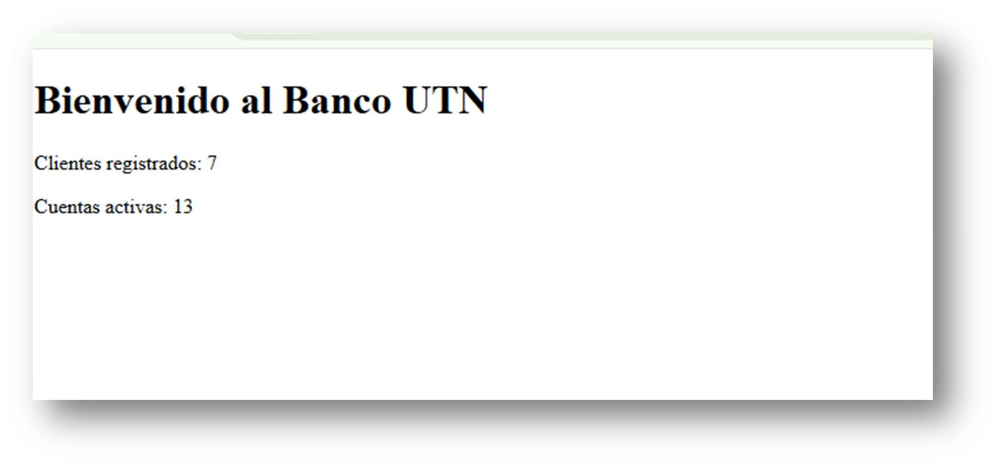

# Capítulo 19. Django: Templates

*Separando lógica y presentación.*

## ¿Por qué leemos este capítulo?

En el capítulo anterior escribimos vistas que hacen su trabajo, pero que
devuelven HTML como string de Python. Cada vista tiene un `HttpResponse` con
un f-string gigante mezclado con lógica. Es un antipatrón evidente: **mezclamos
datos con presentación**.

Este es el capítulo que separa esas dos capas. Django Template Language (DTL)
nos permite:

- Escribir HTML en archivos `.html` separados, con la sintaxis natural de
  HTML.
- Insertar datos en el HTML con marcadores especiales.
- Reutilizar layouts comunes con herencia de templates.
- Aplicar formato a los datos con filtros.

Al final del capítulo, el sistema bancario va a tener aspecto de aplicación
web real: navegación consistente, diseño con Bootstrap, mensajes visuales para
el usuario. Y las vistas van a quedar limpias, dedicadas solo a la lógica.

## El problema que resolvemos

Recordá cómo estaba la vista `detalle_cuenta` en el capítulo anterior:

```python
def detalle_cuenta(request, numero):
    cuenta = get_object_or_404(Cuenta, numero=numero)
    movimientos = cuenta.movimientos.order_by('-fecha')[:10]

    lineas_mov = [
        f"<li>{m.fecha:%d/%m/%Y %H:%M} - {m.tipo} - ${m.monto:,.2f}</li>"
        for m in movimientos
    ]
    html = f"""
    <h1>Cuenta {cuenta.numero}</h1>
    <p>Titular: {cuenta.titular}</p>
    <p>Saldo: ${cuenta.saldo:,.2f}</p>
    <h2>Últimos movimientos</h2>
    <ul>{''.join(lineas_mov) or '<li>Sin movimientos</li>'}</ul>
    """
    return HttpResponse(html)
```

Problemas:

- **HTML mezclado con Python**. Si un diseñador quiere cambiar el layout,
  tiene que meter mano en código Python.
- **Difícil de mantener**. Cambiar `<ul>` por `<table>` implica reescribir la
  lógica de generación de líneas.
- **Repetición**. Cada vista repite el mismo `<html>`, `<head>`, menú de
  navegación, footer.
- **Sin escapado automático**. Si un titular se llama
  `<script>alert('hackeado')</script>`, ese código se ejecuta en el navegador
  - es una vulnerabilidad de seguridad clásica (XSS).

La solución es tener archivos HTML separados donde el HTML se ve como HTML, con
marcadores para insertar datos. Django los llama **templates**.

## Configurando templates

En el archivo **banco_utn/settings.py** hay una sección `TEMPLATES` que Django
ya trae configurada. Por defecto, Django busca templates dentro de cada app,
en una subcarpeta llamada `templates`. Esa es la convención estándar.
Estructura que vamos a armar:


Notá la doble anidación: `banco/templates/banco/`. Es una convención para
evitar colisiones de nombres entre apps. Si mañana agregás otra app llamada
`alertas` que también tenga un `home.html`, Django distingue entre
`banco/home.html` y `alertas/home.html`. Creá esas carpetas y arrancamos.

## Un primer template mínimo

**banco/templates/banco/home.html**

```html
<!-- banco/templates/banco/home.html -->

<!DOCTYPE html>
<html lang="es">
<head>
    <meta charset="UTF-8">
    <title>Banco UTN</title>
</head>
<body>
    <h1>Bienvenido al Banco UTN</h1>
    <p>Clientes registrados: {{ total_personas }}</p>
    <p>Cuentas activas: {{ total_cuentas }}</p>
</body>
</html>
```

El HTML es HTML normal. Lo nuevo son los **{{ variable }}**: marcadores donde
Django va a insertar valores.

Ahora la vista que renderiza este template:

**banco/views.py**

```python
from django.shortcuts import render
from banco.models import PersonaFisica, PersonaJuridica, Cuenta


def home(request):
    contexto = {
        'total_personas': PersonaFisica.objects.count() + PersonaJuridica.objects.count(),
        'total_cuentas': Cuenta.objects.filter(activa=True).count(),
    }
    return render(request, 'banco/home.html', contexto)
```

Comparalo con la versión anterior. La vista queda **mínima**: consulta datos,
arma un diccionario con lo que necesita el template, llama a `render`.

`render` es el atajo de Django que:

1. Toma el template `banco/home.html`.
2. Le pasa el contexto (el diccionario con las variables).
3. Reemplaza los `{{ }}` con los valores del contexto.
4. Devuelve una `HttpResponse` con el HTML resultante.

Recargá `http://127.0.0.1:8000/` en el navegador. Ves el mismo contenido que
antes, pero ahora la vista tiene 4 líneas y el HTML vive en su archivo, listo
para que cualquiera lo modifique sin tocar código Python.



## Sintaxis del Django Template Language

El DTL tiene tres cosas fundamentales:

| Variables | Tags | Filtros |
|---|---|---|
| `{{ variable }}` | `` | `{{ variable\|filtro }}` |
| Inserta un valor. | Controlan el flujo (if, for, etc.). | Transforman valores para mostrarlos. |

Vamos con cada uno.

### Variables

```html
<p>Hola {{ nombre }}</p>
<p>Tu saldo es ${{ cuenta.saldo }}</p>
<p>Tu cuenta {{ cuenta.numero }} tiene {{ cuenta.movimientos.count }} movimientos</p>
```

Notá tres cosas:

- **`cuenta.saldo`**: se accede a atributos con punto, como en Python.
- **`cuenta.movimientos.count`**: podés llamar métodos **sin paréntesis**. El
  DTL detecta que `.count` es callable y lo llama automáticamente.
- **`{{ nombre }}` con nombre inexistente**: si `nombre` no está en el
  contexto, se muestra vacío (no da error). Es una decisión de diseño de
  Django: los templates son tolerantes a datos faltantes.

## Tags de control:  y 

```html

    <p>Cuenta activa</p>

    <p>Cuenta cerrada</p>


<ul>

    <li>{{ movimiento.tipo }}: ${{ movimiento.monto }}</li>

</ul>
```

Los tags empiezan con ``. Cada estructura de control
tiene su tag de apertura y su tag de cierre (``, ``).

Todos los tags de control:

```html
 ...  ...  ... 
 ...  ... 
 texto que no se muestra 
```

`` es un detalle útil: se ejecuta cuando la lista está vacía.

```html
<ul>

    <li>{{ cuenta.numero }} - ${{ cuenta.saldo }}</li>

    <li>No hay cuentas activas</li>

</ul>
```

## Filtros: transformando datos

Los filtros aplican transformaciones a los valores. Se usan con `|`:

```html
{{ nombre|upper }}                <!-- ANA PÉREZ -->
{{ nombre|lower }}                <!-- ana pérez -->
{{ nombre|length }}               <!-- longitud del string -->
{{ saldo|floatformat:2 }}         <!-- 65000.00 -->
{{ fecha|date:"d/m/Y" }}          <!-- 26/07/2026 -->
{{ fecha|date:"d/m/Y H:i" }}      <!-- 26/07/2026 15:42 -->
{{ texto|default:"Sin datos" }}   <!-- si texto es vacío, muestra "Sin datos" -->
{{ lista|first }}                 <!-- primer elemento -->
{{ lista|last }}                  <!-- último elemento -->
```

Los filtros se pueden encadenar:

```html
{{ nombre|lower|title }}          <!-- ana pérez ➡ Ana Pérez -->
```

Filtros muy útiles para el banco:

```html
${{ saldo|floatformat:2 }}                 <!-- $65000.00 -->
{{ fecha|date:"d/m/Y H:i" }}               <!-- 26/07/2026 15:42 -->
{{ movimientos.count }} operaciones        <!-- método llamado automáticamente -->
{{ descripcion|default:"Sin descripción" }}
```

**Formato de números con separador de miles.** Django trae `intcomma` en el
paquete `humanize`, pero requiere activarlo. Para el manual, con `floatformat`
alcanza, el separador se puede agregar más adelante como refinamiento.

## Herencia de templates

El problema que anticipamos: cada template repite el `<html>`, `<head>`, menú
de navegación, footer. Django resuelve esto con **herencia de templates**:
definís un template base con la estructura común, y los templates hijos
**extienden** ese base y solo definen los bloques que son específicos.

**base.html**

```html
<!-- banco/templates/banco/base.html -->
<!DOCTYPE html>
<html lang="es">
<head>
    <meta charset="UTF-8">
    <meta name="viewport" content="width=device-width, initial-scale=1.0">
    <title>Banco UTN</title>

    <!-- Bootstrap 5 desde CDN -->
    <link rel="stylesheet"
href="https://cdn.jsdelivr.net/npm/bootstrap@5.3.0/dist/css/bootstrap.min.css">
</head>
<body>
    <nav class="navbar navbar-expand-lg navbar-dark bg-primary">
        <div class="container">
            <a class="navbar-brand" href="">🏦 Banco UTN</a>
            <div class="navbar-nav">
                <a class="nav-link text-white" href="">Cuentas</a>
                <a class="nav-link text-white" href="">Clientes</a>
            </div>
        </div>
    </nav>

    <main class="container mt-4">
        
            
                <div class="alert alert-{{ mensaje.tags|default:'info' }}">
                    {{ mensaje }}
                </div>
            
        

        
    </main>

    <footer class="container mt-5 mb-3 text-muted text-center">
        <hr>
        <small>Banco UTN - Manual de Programación 2</small>
    </footer>
</body>
</html>
```

Novedades importantes:

**` ... `**: define un bloque que los templates
hijos pueden reemplazar. `titulo` y `contenido` son los que van a variar por
página.

**``**: genera la URL asociada al nombre `banco:home`. Es
el equivalente a `reverse()` en el código Python: **nunca hardcodees URLs en
templates**. Si cambiás la ruta en `urls.py`, todos los links se actualizan
solos.

**``**: muestra los mensajes del sistema
(`messages.success(...)`, `messages.error(...)` de las vistas). El filtro
`|default:'info'` asigna una clase por defecto si el tag no está.

**Bootstrap desde CDN**: importamos la hoja de estilos desde un CDN público. En
proyectos serios, se descargan archivos y se sirven desde el servidor. Para el
manual, CDN alcanza y es más didáctico.

**home.html**

Ahora el `home.html` reescrito para extender el base:

```html
<!-- banco/templates/banco/home.html -->


Home - Banco UTN


    <h1 class="mb-4">Bienvenido al Banco UTN</h1>

    <div class="row">
        <div class="col-md-4">
            <div class="card">
                <div class="card-body">
                    <h5 class="card-title">Clientes</h5>
                    <p class="display-4">{{ total_personas }}</p>
                </div>
            </div>
        </div>
        <div class="col-md-4">
            <div class="card">
                <div class="card-body">
                    <h5 class="card-title">Cuentas activas</h5>
                    <p class="display-4">{{ total_cuentas }}</p>
                </div>
            </div>
        </div>
    </div>

```

**`` debe ser la primera línea** del template.
Le dice a Django: *"heredá todo de base.html, y reemplazá los bloques que voy
a definir"*.

Los `` en el hijo **reemplazan** los del padre. Si un bloque no se
define en el hijo, se usa el contenido del padre (que puede estar vacío o
tener algo).

Recargá `http://127.0.0.1:8000/`. Ahora ves el home con Bootstrap: barra de
navegación azul, tarjetas para las estadísticas, tipografía profesional. Todo
eso vino "gratis" con Bootstrap y la herencia de templates.

## Traduciendo las demás vistas a templates

Con el patrón claro, vamos a rehacer las otras vistas. Todas siguen la misma
estructura: la vista queda mínima, el HTML vive en el template.

**listar_cuentas.html**

```html
<!-- banco/templates/banco/listar_cuentas.html -->


Cuentas - Banco UTN


    <h1 class="mb-4">Cuentas activas</h1>

    <table class="table table-striped">
        <thead>
            <tr>
                <th>Número</th>
                <th>Titular</th>
                <th>Saldo</th>
                <th></th>
            </tr>
        </thead>
        <tbody>
            
                <tr>
                    <td>{{ cuenta.numero }}</td>
                    <td>{{ cuenta.titular }}</td>
                    <td>${{ cuenta.saldo|floatformat:2 }}</td>
                    <td>
                        <a href=""
                           class="btn btn-sm btn-outline-primary">Ver</a>
                    </td>
                </tr>
            
                <tr>
                    <td colspan="4" class="text-center text-muted">
                        No hay cuentas activas
                    </td>
                </tr>
            
        </tbody>
    </table>

```

Fijate el ``: cuando la URL tiene
un parámetro, se lo pasás como argumento posicional al tag `url`. Django
construye la URL correcta.

La vista se simplifica dramáticamente:

```python
def listar_cuentas(request):
    cuentas = Cuenta.objects.filter(activa=True).order_by('-saldo')
    return render(request, 'banco/listar_cuentas.html', {'cuentas': cuentas})
```

Dos líneas de lógica. Todo lo visual está en el template.

**detalle_cuenta.html**

```html
<!-- banco/templates/banco/detalle_cuenta.html -->


Cuenta {{ cuenta.numero }}


    <h1>Cuenta {{ cuenta.numero }}</h1>

    <div class="card mb-4">
        <div class="card-body">
            <h5 class="card-title">Datos de la cuenta</h5>
            <dl class="row">
                <dt class="col-sm-3">Titular</dt>
                <dd class="col-sm-9">{{ cuenta.titular }}</dd>

                <dt class="col-sm-3">CBU</dt>
                <dd class="col-sm-9">{{ cuenta.cbu }}</dd>

                <dt class="col-sm-3">Saldo</dt>
                <dd class="col-sm-9">
                    <span class="fs-4 fw-bold">${{ cuenta.saldo|floatformat:2 }}</span>
                </dd>

                <dt class="col-sm-3">Estado</dt>
                <dd class="col-sm-9">
                    
                        <span class="badge bg-success">Activa</span>
                    
                        <span class="badge bg-secondary">Cerrada</span>
                    
                </dd>
            </dl>
        </div>
    </div>

    
        <div class="mb-4">
            <a href=""
               class="btn btn-success">Depositar</a>
            <a href=""
               class="btn btn-warning">Extraer</a>
            <a href=""
               class="btn btn-primary">Transferir</a>
        </div>
    

    <h3>Últimos movimientos</h3>
    <table class="table table-sm">
        <thead>
            <tr>
                <th>Fecha</th>
                <th>Tipo</th>
                <th class="text-end">Monto</th>
                <th class="text-end">Saldo posterior</th>
                <th>Descripción</th>
            </tr>
        </thead>
        <tbody>
            
                <tr>
                    <td>{{ m.fecha|date:"d/m/Y H:i" }}</td>
                    <td>{{ m.get_tipo_display }}</td>
                    <td class="text-end">${{ m.monto|floatformat:2 }}</td>
                    <td class="text-end">${{ m.saldo_posterior|floatformat:2 }}</td>
                    <td>{{ m.descripcion|default:"-" }}</td>
                </tr>
            
                <tr>
                    <td colspan="5" class="text-center text-muted">Sin movimientos</td>
                </tr>
            
        </tbody>
    </table>

```

Un detalle interesante: **`{{ m.get_tipo_display }}`**. Cuando un `CharField`
tiene `choices`, Django genera automáticamente un método `get_<campo>_display`
que devuelve la etiqueta legible en lugar del código interno. En vez de
mostrar "deposito", muestra "Depósito".

Y la vista:

```python
def detalle_cuenta(request, numero):
    cuenta = get_object_or_404(Cuenta, numero=numero)
    movimientos = cuenta.movimientos.order_by('-fecha')[:10]
    contexto = {
        'cuenta': cuenta,
        'movimientos': movimientos,
    }
    return render(request, 'banco/detalle_cuenta.html', contexto)
```

Cuatro líneas de lógica pura. Sin HTML. Sin f-strings. Sin duplicación.

## Formularios con CSRF

Uno de los pendientes del capítulo anterior era el **token CSRF**. Los
formularios que enviábamos por POST no tenían la protección, y Django los
rechazaba en producción.

Con templates, esto se resuelve con **un tag**: ``.

**formulario_operacion.html**

```html
<!-- banco/templates/banco/formulario_operacion.html -->


{{ titulo }} - {{ cuenta.numero }}


    <h1>{{ titulo }}</h1>
    <p class="text-muted">Cuenta: {{ cuenta.numero }} - Saldo actual: ${{ cuenta.saldo|floatformat:2 }}</p>

    <form method="post" class="mt-4">
        

        
            <div class="mb-3">
                <label for="destino" class="form-label">Cuenta destino</label>
                <input type="text" name="destino" id="destino" class="form-control" required>
            </div>
        

        <div class="mb-3">
            <label for="monto" class="form-label">Monto</label>
            <input type="number" name="monto" id="monto" class="form-control"
                   step="0.01" min="0.01" required>
        </div>

        <button type="submit" class="btn btn-primary">Confirmar</button>
        <a href=""
           class="btn btn-secondary">Cancelar</a>
    </form>

```

`` genera un input oculto con el token de seguridad. Django lo
valida automáticamente al recibir el POST. **Es imprescindible en todos los
formularios**.

Con este template genérico, podemos reutilizarlo para depositar, extraer y
transferir. Las vistas quedan así:

```python
def depositar_en_cuenta(request, numero):
    cuenta = get_object_or_404(Cuenta, numero=numero)

    if request.method == 'POST':
        monto = float(request.POST.get('monto', 0))
        try:
            cuenta.depositar(monto, descripcion="Depósito web")
            messages.success(request, f"Depósito de ${monto:,.2f} realizado")
        except Exception as e:
            messages.error(request, f"Error: {e}")
        return redirect('banco:detalle_cuenta', numero=numero)

    contexto = {
        'cuenta': cuenta,
        'titulo': 'Depositar',
        'pedir_destino': False,
    }
    return render(request, 'banco/formulario_operacion.html', contexto)


def extraer_de_cuenta(request, numero):
    cuenta = get_object_or_404(Cuenta, numero=numero)

    if request.method == 'POST':
        monto = float(request.POST.get('monto', 0))
        try:
            cuenta.extraer(monto, descripcion="Extracción web")
            messages.success(request, f"Extracción de ${monto:,.2f} realizada")
        except Exception as e:
            messages.error(request, f"Error: {e}")
        return redirect('banco:detalle_cuenta', numero=numero)

    contexto = {
        'cuenta': cuenta,
        'titulo': 'Extraer',
        'pedir_destino': False,
    }
    return render(request, 'banco/formulario_operacion.html', contexto)


def transferir_desde_cuenta(request, numero):
    origen = get_object_or_404(Cuenta, numero=numero)

    if request.method == 'POST':
        numero_destino = request.POST.get('destino')
        monto = float(request.POST.get('monto', 0))
        try:
            destino = Cuenta.objects.get(numero=numero_destino)
            origen.extraer(monto, descripcion=f"Transferencia a {numero_destino}")
            destino.depositar(monto, descripcion=f"Transferencia de {numero}")
            messages.success(request, f"Transferencia de ${monto:,.2f} realizada")
        except Cuenta.DoesNotExist:
            messages.error(request, f"La cuenta {numero_destino} no existe")
        except Exception as e:
            messages.error(request, f"Error: {e}")
        return redirect('banco:detalle_cuenta', numero=numero)

    contexto = {
        'cuenta': origen,
        'titulo': 'Transferir',
        'pedir_destino': True,
    }
    return render(request, 'banco/formulario_operacion.html', contexto)
```

Un solo template sirve para tres vistas. Cada una le pasa un contexto distinto
y el template se adapta.

Ahora los formularios funcionan sin `@csrf_exempt`. La protección de Django
está activa, como corresponde.

## Mensajes al usuario

Ya integramos `` en el `base.html`. Los mensajes de
`messages.success()` y `messages.error()` aparecen automáticamente al
principio de cada página después de una redirección.

Bootstrap tiene clases predefinidas para tipos de alerta: `alert-success`
(verde), `alert-danger` (rojo), `alert-warning` (amarillo), `alert-info`
(azul). Django asigna automáticamente un tag a cada mensaje según su nivel.
Nuestro código en `base.html` lo aprovecha con
`{{ mensaje.tags|default:'info' }}`.

Con esto, cuando el usuario hace un depósito exitoso:

1. La vista llama `messages.success(request, "Depósito realizado")`.
2. La vista redirige a `detalle_cuenta`.
3. `detalle_cuenta` renderiza el template.
4. `base.html` detecta que hay mensajes y los muestra como alerta verde
   arriba.

El usuario ve inmediatamente el feedback. Y como la lógica está en el
`base.html`, ninguna vista tiene que preocuparse por mostrarlos.

**Detalle importante**: en Django, los mensajes tienen que activarse en el
`MessagesMiddleware`, que viene activo por defecto. Si por alguna razón lo
desactivaron, los mensajes no aparecen. En `settings.py` verificá que esté en
`MIDDLEWARE`:

```python
MIDDLEWARE = [
    'django.contrib.sessions.middleware.SessionMiddleware',
    'django.contrib.messages.middleware.MessageMiddleware',    # este
    # ...
]
```

Django lo trae activo *out of the box*, no habría que tocarlo.

## Archivos estáticos: CSS, imágenes, JavaScript propios

Bootstrap desde CDN nos ahorra mucho, pero eventualmente vas a querer **tu
propio CSS**, imágenes de logos, quizás algo de JavaScript. Django los llama
**archivos estáticos**.

Estructura típica:

![Diagrama de árbol de carpetas del proyecto con los archivos estáticos. La raíz "banco" contiene: ".venv"; "banco_utn"; "banco", la app (con __init__.py, admin.py, urls.py, apps.py, models.py, tests.py, views.py, migrations y templates); y manage.py. Dentro de "templates" hay una carpeta "banco" con base.html, home.html, listar_cuentas.html, detalle_cuentas.html, listar_personas.html, detalle_persona.html y formulario_operacion.html. Además, dentro de la app hay una carpeta "static" con una subcarpeta "banco" que contiene tres carpetas: "css" con estilo.css, "img" con logo.png y "js" con custom.js.](images/cap19-estructura-static.png)

Igual que los templates, se anidan por app.

En el template base, para linkear archivos estáticos usás el tag
``:

```html

<!DOCTYPE html>
<html lang="es">
<head>
    <title>...</title>
    <link rel="stylesheet" href="">
</head>
<body>
    
    <!-- ... -->
    <script src=""></script>
</body>
</html>
```

**`` en la primera línea del template** habilita el tag
`static`. Después, `` genera la URL correcta.

En desarrollo, Django sirve los archivos estáticos automáticamente. En
producción, los sirve un servidor web (Nginx, Apache) con configuración
distinta - tema del capítulo 24.

## Inclusión: reutilizar fragmentos

Además de herencia, DTL ofrece **inclusión**: insertar un template dentro de
otro. Es útil para componentes reutilizables que no encajan en herencia.

Ejemplo: una tarjeta de cuenta que aparece en varias páginas. Creá

**banco/templates/banco/_tarjeta_cuenta.html:**

```html
<!-- Fragmento reutilizable: tarjeta de una cuenta -->
<div class="card mb-3">
    <div class="card-body">
        <h5 class="card-title">{{ cuenta.numero }}</h5>
        <p class="card-text">
            <strong>Titular:</strong> {{ cuenta.titular }}<br>
            <strong>Saldo:</strong> ${{ cuenta.saldo|floatformat:2 }}
        </p>
        <a href=""
           class="btn btn-sm btn-primary">Ver detalle</a>
    </div>
</div>
```

**Convención:** los templates que son solo fragmentos (no se renderizan
directamente) empiezan con guion bajo. No es una regla técnica, pero ayuda a
distinguirlos visualmente.

Después, en cualquier template, lo incluís:

```html

    

```

Django renderiza el fragmento con el contexto actual, la variable `cuenta` del
`for` está disponible dentro del `include`.

Podés pasarle contexto extra explícitamente:

```html

```

## Herencia vs inclusión:

- **Herencia** (`extends`): para el **layout** (una página que hereda
  estructura general).
- **Inclusión** (`include`): para **componentes** (un fragmento reutilizable
  dentro de una página).

Ambas son complementarias.

## Buenas prácticas

Cerramos el capítulo con lo que emergió a lo largo:

1. **Un template por vista.** Cada vista debería tener su template propio (o
   compartir uno si son casi iguales, como los tres formularios del banco).
2. **Un template base por app** (o por sección del sitio). Todos los demás
   heredan de él.
3. **Nombre de bloques descriptivo.** `` mejor que
   ``.
4. **Nunca hardcodees URLs.** Siempre ``. Si
   cambia la ruta en `urls.py`, los templates se actualizan solos.
5. **Usá filtros para formato.** `{{ saldo|floatformat:2 }}` es más limpio que
   formatear en la vista y pasar el string.
6. **Mantené la lógica en las vistas, no en templates.** Los templates son
   declarativos: describen qué mostrar. Cálculos complejos, iteraciones
   anidadas oscuras, filtros de datos - todo eso va en la vista. Si el
   template empieza a tener demasiada lógica, algo está mal.
7. **Django escapa HTML por defecto.** Si un usuario se llama `<script>`,
   Django lo escapa automáticamente al insertarlo en un template. **Nunca
   desactives esto** a menos que estés absolutamente seguro (por ejemplo,
   mostrando HTML preformateado que vos generaste).

En el próximo capítulo **Formularios**, vamos a mejorar la parte de recepción
de datos. Los formularios que armamos a mano en este capítulo funcionan, pero
tienen varios problemas: validaciones básicas repetidas, sin feedback en el
input mismo, sin campos personalizados. Django tiene una clase `Form` y otra
`ModelForm` que resuelven todo eso automáticamente, generando el HTML correcto
con validaciones incluidas, muy en el estilo del admin.

Y para el capítulo 22 viene la parte fundamental de un banco: **autenticación
de usuarios**, para que cada cliente solo vea sus propias cuentas.
